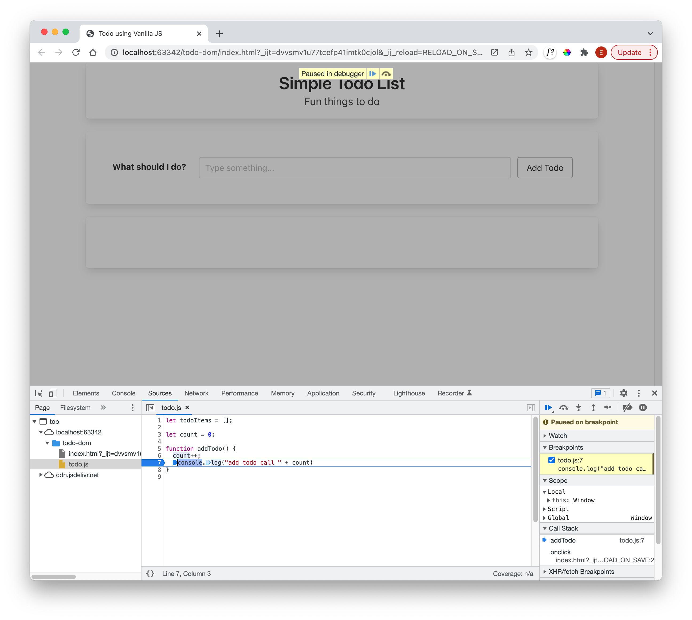

# Event Handling

Add the following to the javascript file:

## todo.js

~~~javascript
let todoItems = [];
let count = 0;

function addTodo() {
  count++;
  console.log("add todo call " + count)
}
~~~

A simple counter, which we log to the console whenever addTodo() is called.

In index.html, change the button to call this function when the button is pressed:

## index.html

~~~html
           <button onClick="addTodo()" class="button">Add Todo</button>
~~~

Open the page, an also open developer console:

We should see the calls logged every time you press the Add Todo button.

You should also practice debugging - open the todo.js and create a breakpoint on the console.log statement any double clicking in the margin:

One last change - replace the log statement in the function with the following version:

~~~javascript
  console.log(`add todo call ${count}`)
~~~

In the above we are using javascript [template strings](https://developer.mozilla.org/en-US/docs/Web/JavaScript/Reference/Template_literals)