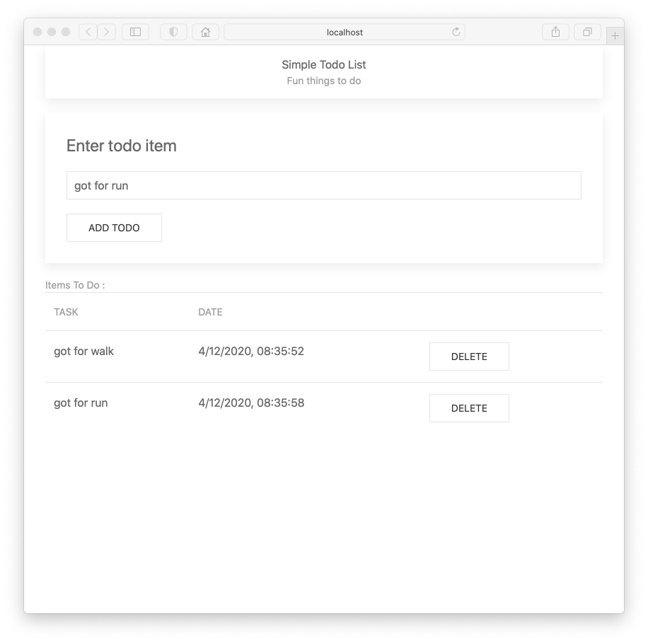
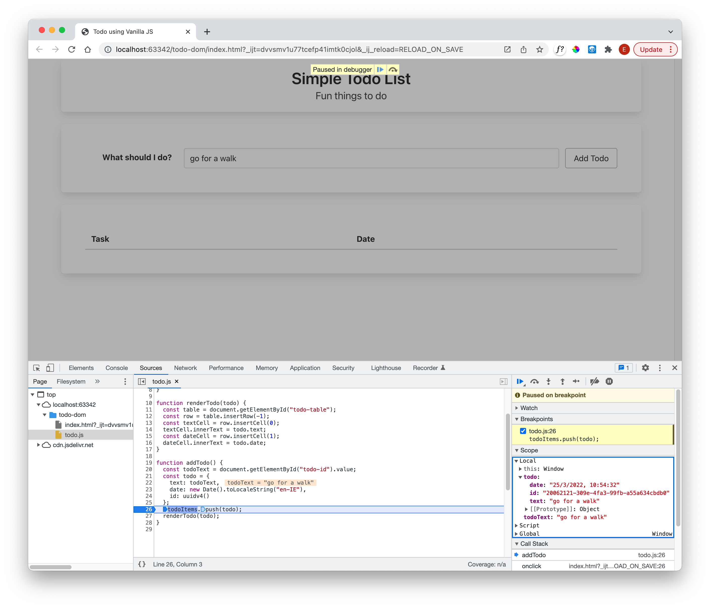

# Support ID

We would like to have the ability to delete items via a button on each item:

Pressing the button should remove the item from the list immediately.

In order to be able to delete an item, we might like to be able to identify the item unambiguously. To prepare for this feature, introduce this new function:

## todo.js

~~~javascript
function uuidv4() {
  return "xxxxxxxx-xxxx-4xxx-yxxx-xxxxxxxxxxxx".replace(/[xy]/g, function(c) {
    var r = Math.random() * 16 | 0, v = c == "x" ? r : (r & 0x3 | 0x8);
    return v.toString(16);
  });
}
~~~

This is a general purpose function to generate a unique ID, based on the UUID conventions:

- [Universially Unique Identifier](https://en.wikipedia.org/wiki/Universally_unique_identifier)

We can now modify addTodo to include a an ID:

~~~javascript
function addTodo() {
  ...
  const todo = {
    text: todoText,
    date: new Date().toLocaleString("en-IE"),
    id: uuidv4()
  };
  ...
}
~~~

We do not display the id, so we leave the renderTodo method as is.

Debug the application to confirm that ids are being generated:

