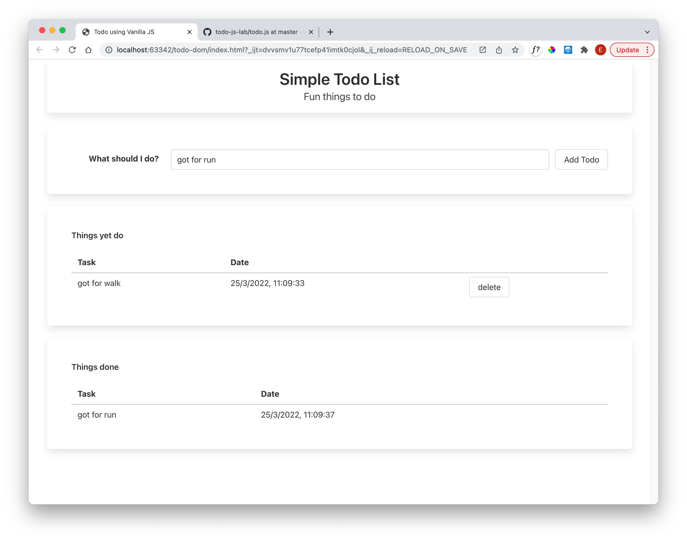

# Solution

Lab so far:

- [todo-0.2.0](https://github.com/wit-hdip-comp-sci-2023/full-stack-1/tree/main/prj/todo/todo-dom-0.2.0)

## Exercise 1

Change the way delete button works so that pressing delete will move the item to `Items Completed` table:

... removing it from the `Items ToDo table`.
