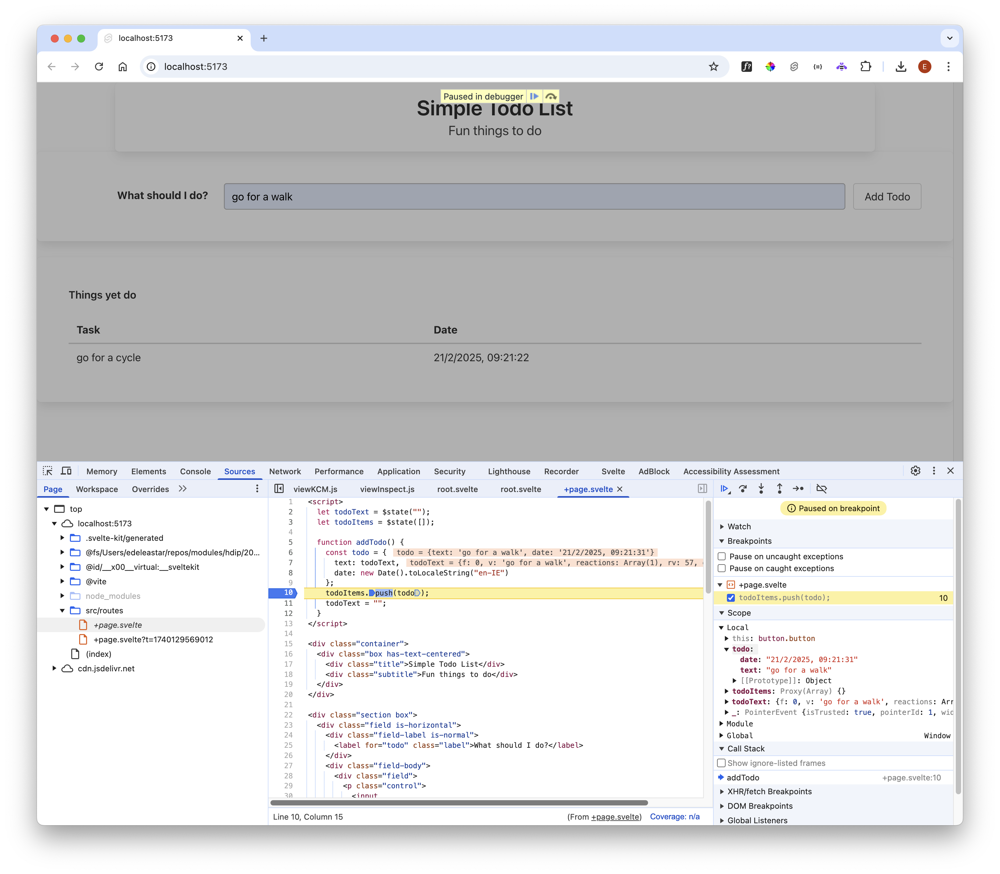

# Todo Object

This is an alternative `addTodo()` function:

~~~javascript
  function addTodo() {
    const todo = {
      text: todoText,
      date: new Date().toLocaleString("en-IE"),
    };
    todoItems.push(todo);
    todoText = "";
  }
~~~

In this version, we are storing the text + the current date.

Rework the table to display a header + both values:

~~~html

  
Things yet do

  <table class="table is-fullwidth">
    <thead>
      <tr>
        <th>Task</th>
        <th>Date</th>
      </tr>
    </thead>
    <tbody>
      {#each todoItems as todo}
        <tr>
          <td>{todo.text}</td>
          <td>{todo.date}</td>
        </tr>
      {/each}
    </tbody>
  </table>

~~~

This should behave like this:

Notice that when we enter a todo and press the button, the text remains in the "What should I do" field. Change the way todoText is declared:

~~~javascript
  let todoText = $state("");
~~~

The todo field should now be cleared every time you enter new text and press "Add Todo".

You can debug the application source:

Try setting some breakpoints as shown above and inspecting the data structures.

The is the complete +page.svelte at this stage:

~~~html

  

    
Simple Todo List

    
Fun things to do

  

  

    

      

        <label for="todo" class="label">What should I do?</label>
      

      

        

          

            <input
              bind:value={todoText}
              id="todo"
              class="input"
              type="text"
              placeholder="Type something..."
            />
          

        

        <button onclick={() => addTodo()} class="button">Add Todo</button>
      

    

  

  

    
Things yet do

    <table class="table is-fullwidth">
      <thead>
        <tr>
          <th>Task</th>
          <th>Date</th>
        </tr>
      </thead>
      <tbody>
        {#each todoItems as todo}
          <tr>
            <td>{todo.text}</td>
            <td>{todo.date}</td>
          </tr>
        {/each}
      </tbody>
    </table>
  

~~~

