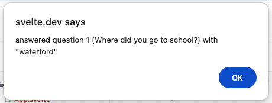
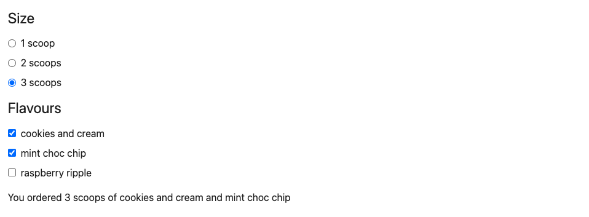
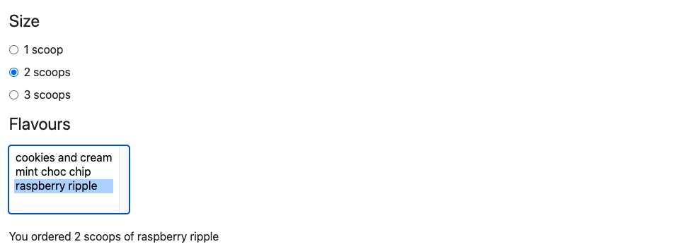
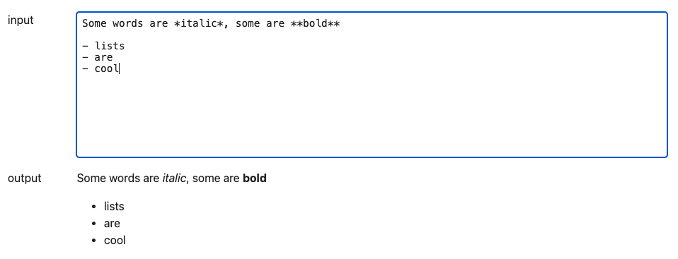

# Bindings

## Text inputs

As a general rule, data flow in Svelte is _top down_ — a parent component can set props on a child component, and a component can set attributes on an element, but not the other way around.

Sometimes it's useful to break that rule. Take the case of the `<input>` element in this component — we _could_ add an `oninput` event handler that sets the value of `name` to `event.target.value`, but it's a bit... boilerplatey. It gets even worse with other form elements, as we'll see.

Instead, we can use the `bind:value` directive:

~~~svelte
<input bind:value={name}>
~~~

This means that not only will changes to the value of `name` update the input value, but changes to the input value will update `name`.

#### App.svelte

~~~svelte

<input bind:value={name} />

<h1>Hello {name}!</h1>
~~~

## Numeric inputs

In the DOM, every input value is a string. That's unhelpful when you're dealing with numeric inputs — `type="number"` and `type="range"` — as it means you have to remember to coerce `input.value` before using it.

With `bind:value`, Svelte takes care of it for you:

~~~svelte
<label>
  <input type="number" bind:value={a} min="0" max="10" />
  <input type="range" bind:value={a} min="0" max="10" />
</label>

<label>
  <input type="number" bind:value={b} min="0" max="10" />
  <input type="range" bind:value={b} min="0" max="10" />
</label>
~~~

#### App.svelte

~~~svelte

<label>
  <input type="number" bind:value={a} min="0" max="10" />
  <input type="range" bind:value={a} min="0" max="10" />
</label>

<label>
  <input type="number" bind:value={b} min="0" max="10" />
  <input type="range" bind:value={b} min="0" max="10" />
</label>

{a} + {b} = {a + b}

~~~

## Checkbox inputs

Checkboxes are used for toggling between states. Instead of binding to `input.value`, we bind to `input.checked`:

~~~svelte
<input type="checkbox" bind:checked={yes}>
~~~

#### App.svelte

~~~svelte

<label>
  <input type="checkbox" bind:checked={yes} />
  Yes! Send me regular email spam
</label>

{#if yes}
  

    Thank you. We will bombard your inbox and sell
    your personal details.
  

{:else}
  

    You must opt in to continue. If you're not
    paying, you're the product.
  

{/if}

<button disabled={!yes}>Subscribe</button>
~~~

## Select bindings

We can also use `bind:value` with `<select>` elements:

~~~svelte
<select
    bind:value={selected}
    onchange={() => answer = ''}
>
~~~

Note that the `<option>` values are objects rather than strings. Svelte doesn't mind.

> [!NOTE] Because we haven't set an initial value of `selected`, the binding will set it to the default value (the first in the list) automatically. Be careful though — until the binding is initialised, `selected` remains undefined, so we can't blindly reference e.g. `selected.id` in the template.

#### App.svelte

~~~svelte

<h2>Insecurity questions</h2>

<form onsubmit={handleSubmit}>
  <select
    bind:value={selected}
    onchange={() => (answer = '')}
  >
    {#each questions as question}
      <option value={question}>
        {question.text}
      </option>
    {/each}
  </select>

  <input bind:value={answer} />

  <button disabled={!answer} type="submit">
    Submit
  </button>
</form>

  selected question {selected
    ? selected.id
    : '[waiting...]'}

~~~

## Group inputs

If you have multiple `type="radio"` or `type="checkbox"` inputs relating to the same value, you can use `bind:group` along with the `value` attribute. Radio inputs in the same group are mutually exclusive; checkbox inputs in the same group form an array of selected values.

Add `bind:group={scoops}` to the radio inputs...

~~~svelte
<input
  type="radio"
  name="scoops"
  value={number}
  bind:group={scoops}
/>
~~~

...and `bind:group={flavours}` to the checkbox inputs:

~~~svelte
<input
  type="checkbox"
  name="flavours"
  value={flavour}
  bind:group={flavours}
/>
~~~

#### App.svelte

~~~svelte

<h2>Size</h2>

{#each [1, 2, 3] as number}
  <label>
    <input
      type="radio"
      name="scoops"
      value={number}
      bind:group={scoops}
    />

    {number} {number === 1 ? 'scoop' : 'scoops'}
  </label>
{/each}

<h2>Flavours</h2>

{#each ['cookies and cream', 'mint choc chip', 'raspberry ripple'] as flavour}
  <label>
    <input
      type="checkbox"
      name="flavours"
      value={flavour}
      bind:group={flavours}
    />

    {flavour}
  </label>
{/each}

{#if flavours.length === 0}
  
Please select at least one flavour

{:else if flavours.length > scoops}
  
Can't order more flavours than scoops!

{:else}
  

    You ordered {scoops} {scoops === 1 ? 'scoop' : 'scoops'}
    of {formatter.format(flavours)}
  

{/if}
~~~

## Select multiple

A `<select>` element can have a `multiple` attribute, in which case it will populate an array rather than selecting a single value.

Replace the checkboxes with a `<select multiple>`:

~~~svelte
<h2>Flavours</h2>

<select multiple bind:value={flavours}>
  {#each ['cookies and cream', 'mint choc chip', 'raspberry ripple'] as flavour}
   <option>{flavour}</option>
  {/each}
</select>
~~~

Note that we're able to omit the `value` attribute on the `<option>`, since the value is identical to the element's contents.

> [!NOTE] Press and hold the `control` key (or the `command` key on MacOS) to select multiple options.

#### App.svelte

~~~svelte

<h2>Size</h2>

{#each [1, 2, 3] as number}
  <label>
    <input
      type="radio"
      name="scoops"
      value={number}
      bind:group={scoops}
    />

    {number} {number === 1 ? 'scoop' : 'scoops'}
  </label>
{/each}

<h2>Flavours</h2>

<select multiple bind:value={flavours}>
  {#each ['cookies and cream', 'mint choc chip', 'raspberry ripple'] as flavour}
    <option>{flavour}</option>
  {/each}
</select>

{#if flavours.length === 0}
  
Please select at least one flavour

{:else if flavours.length > scoops}
  
Can't order more flavours than scoops!

{:else}
  

    You ordered {scoops} {scoops === 1 ? 'scoop' : 'scoops'}
    of {formatter.format(flavours)}
  

{/if}
~~~

## Textarea inputs

The `<textarea>` element behaves similarly to a text input in Svelte — use `bind:value`:

~~~svelte
<textarea bind:value={value}></textarea>
~~~

In cases like these, where the names match, we can also use a shorthand form:

~~~svelte
<textarea bind:value></textarea>
~~~

This applies to all bindings, not just `<textarea>` bindings.

#### App.svelte

~~~svelte

  input
  <textarea bind:value></textarea>

  output
  
{@html marked(value)}

~~~

