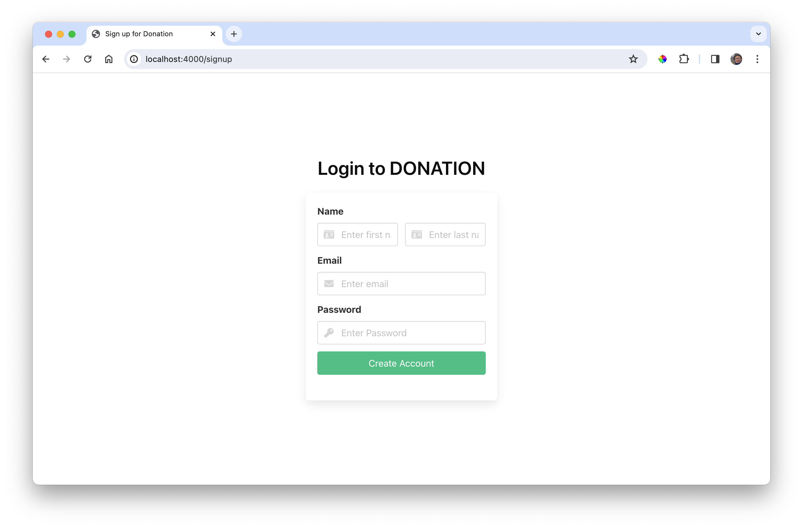
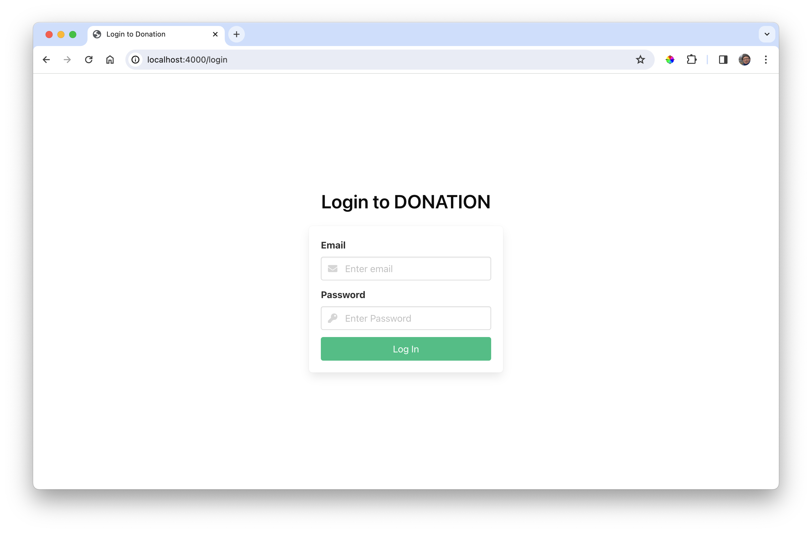
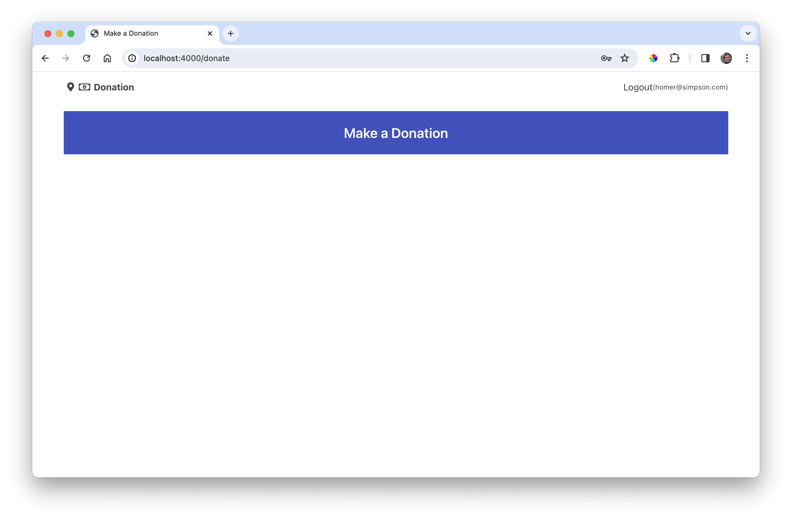

# Views

Introduce the following views:

### Views/Login.hbs

~~~handlebars
<section class="hero is-fullheight">
  

    

      

        <h3 class="title has-text-black has-text-centered">Login to DONATION</h3>
        

          {{> LoginForm }}
        

      

    

  

</section>
~~~

### Views/Signup.hbs

~~~handlebars
<section class="hero is-fullheight">
  

    

      

        <h3 class="title has-text-black has-text-centered">Login to DONATION</h3>
        

          {{> SignupForm }}
        

      

    

  

</section>
~~~

### Views/Donate.hbs

~~~handlebars
{{> Menu }}
{{> Heading}}
~~~

