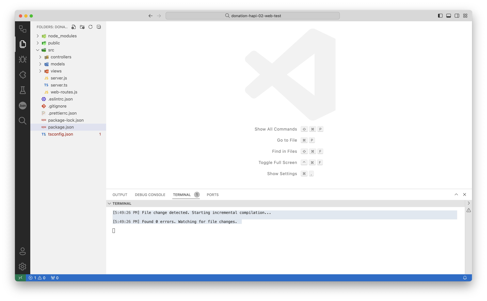
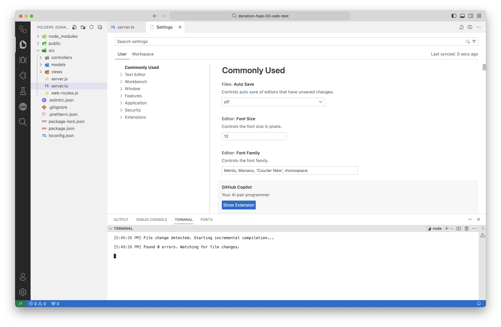
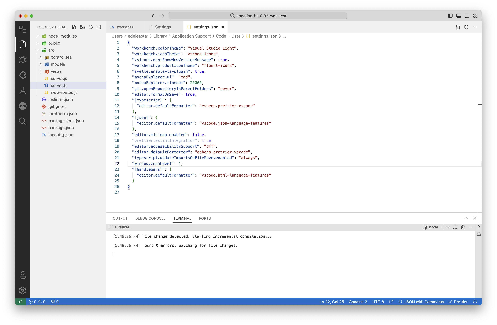
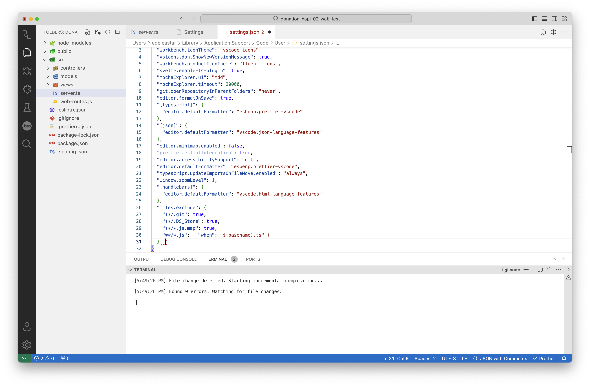

### First TypeScript module

Rename server.js to server.ts

The terminal where we are currently running the 'npm run dev:tsc' should no longer show an error:

~~~bash
[5:49:26 PM] File change detected. Starting incremental compilation...

[5:49:26 PM] Found 0 errors. Watching for file changes.
~~~

One thing you should notice immediately is that you now have 2 server files:

- server.ts
- server.js

This js file is generated by the TypeScript compiler. Currently it is largely the same as the corresponding js file. We should never edit this file - as it will be overwritten with every change to the js file.

We can hide it completely in VSCode. First open Settings:

Press the 'Open Settings JSON' button on the top right:

Your actual setting will vary, however, include the following new entry:

~~~json
  "files.exclude": {
    "**/.git": true,
    "**/.DS_Store": true,
    "**/*.js.map": true,
    "**/*.js": { "when": "$(basename).ts" }
  },
~~~

This should immediately hide server.js:

The js files will not be removed (they are needed to execute your program), just hidden.