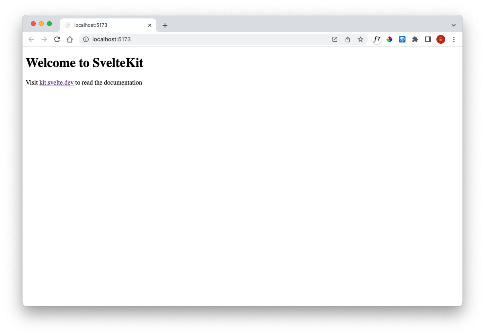

# Create

Open a shell an enter these commands:

~~~bash
npx sv create donation-svelte
~~~

In the subsequent menus, select the following options:

~~~bash
┌  Welcome to the Svelte CLI! (v0.6.21)
│
◆  Which template would you like?
│  ● SvelteKit minimal (barebones scaffolding for your new app)
│  ○ SvelteKit demo
│  ○ Svelte library
└◆  Add type checking with Typescript?
│  ● Yes, using Typescript syntax
│  ○ Yes, using Javascript with JSDoc comments
│  ○ No
└◆  What would you like to add to your project? (use arrow keys / space bar)
│  ◼ prettier
│  ◼ eslint (linter - https://eslint.org)
│  ◻ vitest
│  ◻ playwright
│  ◻ tailwindcss
│  ◻ sveltekit-adapter
│  ◻ drizzle
│  ◻ lucia
│  ◻ mdsvex
│  ◻ paraglide
│  ◻ storybook
└◆  Successfully setup add-ons
│
◆  Which package manager do you want to install dependencies with?
│  ○ None
│  ● npm
│  ○ yarn
│  ○ pnpm
│  ○ bun
│  ○ deno
└
~~~

Check that the package.json file looks like this:

~~~json

	"name": "donation-svelte",
	"version": "0.0.1",
	"private": true,
	"scripts": {
		"dev": "vite dev",
		"build": "vite build",
		"preview": "vite preview",
		"check": "svelte-kit sync && svelte-check --tsconfig ./tsconfig.json",
		"check:watch": "svelte-kit sync && svelte-check --tsconfig ./tsconfig.json --watch",
		"lint": "prettier --check . && eslint .",
		"format": "prettier --write ."
	},
	"devDependencies": {
		"@sveltejs/adapter-auto": "^3.0.0",
		"@sveltejs/kit": "^2.0.0",
		"@sveltejs/vite-plugin-svelte": "^3.0.0",
		"@types/eslint": "^8.56.0",
		"@typescript-eslint/eslint-plugin": "^7.0.0",
		"@typescript-eslint/parser": "^7.0.0",
		"eslint": "^8.56.0",
		"eslint-config-prettier": "^9.1.0",
		"eslint-plugin-svelte": "^2.35.1",
		"prettier": "^3.1.1",
		"prettier-plugin-svelte": "^3.1.2",
		"svelte": "^4.2.7",
		"svelte-check": "^3.6.0",
		"tslib": "^2.4.1",
		"typescript": "^5.0.0",
		"vite": "^5.0.3"
	},
	"type": "module"
}
~~~

We might like to update the modules at this stage. This tool here is useful for this:

- <https://www.npmjs.com/package/npm-check-updates>

When installed, we can check the versions like this:

~~~bash
cd donation-svelte
ncu
~~~

It will list the current versions + the latest (without changing anything):

~~~bash
 @eslint/compat                  ^1.2.5  →   ^1.2.7     
 @eslint/js                     ^9.18.0  →  ^9.21.0     
 @sveltejs/kit                  ^2.16.0  →  ^2.17.2     
 @sveltejs/vite-plugin-svelte    ^5.0.0  →   ^5.0.3     
 eslint                         ^9.18.0  →  ^9.21.0     
 globals                       ^15.14.0  →  ^16.0.0     
 prettier                        ^3.4.2  →   ^3.5.2     
 svelte                          ^5.0.0  →  ^5.20.2     
 svelte-check                    ^4.0.0  →   ^4.1.4     
 typescript                      ^5.0.0  →   ^5.7.3     
 typescript-eslint              ^8.20.0  →  ^8.24.1     
 vite                            ^6.0.0  →   ^6.1.1  
~~~

If you wish to update everything, then try this command:

~~~bash
ncu -u
~~~

This will replace all old versions with the new ones. Updating patch and minor should be fine, but you may need to be cautious about major version changes.

Now we can install these new packages and run the application:

~~~bash
npm install
npm run dev
~~~

This should respond with:

~~~bash
> donation-svelte@0.0.1 dev
> vite dev

9:19:33 AM [vite] (client) Forced re-optimization of dependencies

  VITE v6.1.1  ready in 1034 ms

  ➜  Local:   http://localhost:5173/
  ➜  Network: use --host to expose
  ➜  press h + enter to show help
9:19:37 AM [vite] (client) ✨ new dependencies optimized: clsx
9:19:37 AM [vite] (client) ✨ optimized dependencies changed. reloading
~~~

Browsing to:

- <http://localhost:5173/>

Should yield:

Lets bring in Bulma, Font Awesome and Open Sans fonts to our header:

### /src/app.html

~~~html
<!doctype html>
<html lang="en">
  <head>
    <meta charset="utf-8" />
    <link rel="icon" href="%sveltekit.assets%/favicon.png" />
    <meta name="viewport" content="width=device-width, initial-scale=1" />
    <link rel="stylesheet" href="https://cdn.jsdelivr.net/npm/bulma@1.0.0/css/bulma.min.css" />
    <link
      rel="stylesheet"
      href="https://cdnjs.cloudflare.com/ajax/libs/font-awesome/5.15.1/css/all.min.css"
      integrity="sha512-+4zCK9k+qNFUR5X+cKL9EIR+ZOhtIloNl9GIKS57V1MyNsYpYcUrUeQc9vNfzsWfV28IaLL3i96P9sdNyeRssA=="
      crossorigin="anonymous"
    />
    <link
      href="https://fonts.googleapis.com/css?family=Open+Sans:400,600,300"
      rel="stylesheet"
      type="text/css"
    />
    %sveltekit.head%
  </head>
  <body data-sveltekit-preload-data="hover">
    
%sveltekit.body%

  </body>
</html>
~~~

Replace the +page.svelte with this:

### src/routes/+page.svelte

~~~html

Hello from Donation!

~~~

If the app is still running, it will look like this:

### Code Formatting

Prettier is set up as the default code formatter. For this lab we are using these settings (different from the defaults):

### .prettierrc

~~~json
{
  "useTabs": false,
  "singleQuote": false,
  "trailingComma": "none",
  "printWidth": 100,
  "plugins": ["prettier-plugin-svelte"],
  "overrides": [
    {
      "files": "*.svelte",
      "options": {
        "parser": "svelte"
      }
    }
  ]
}
~~~

