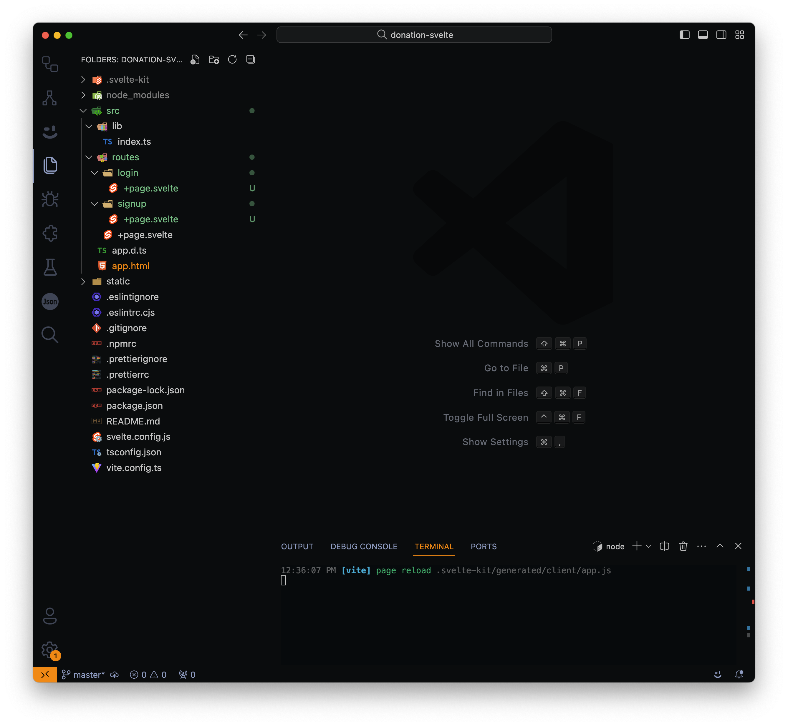
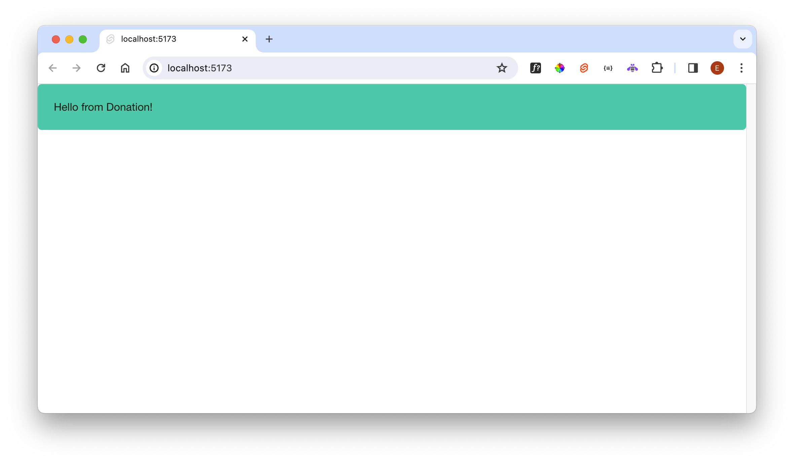
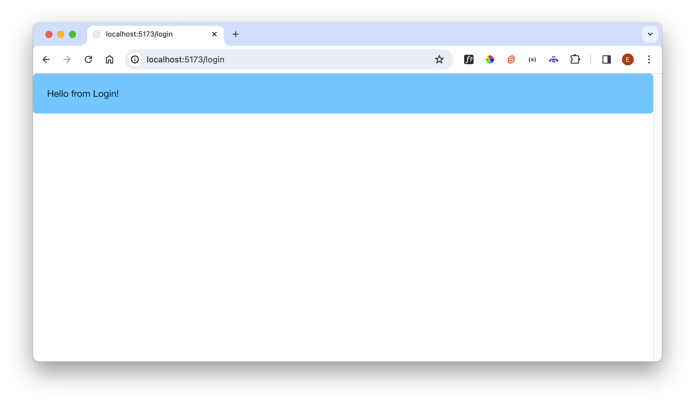
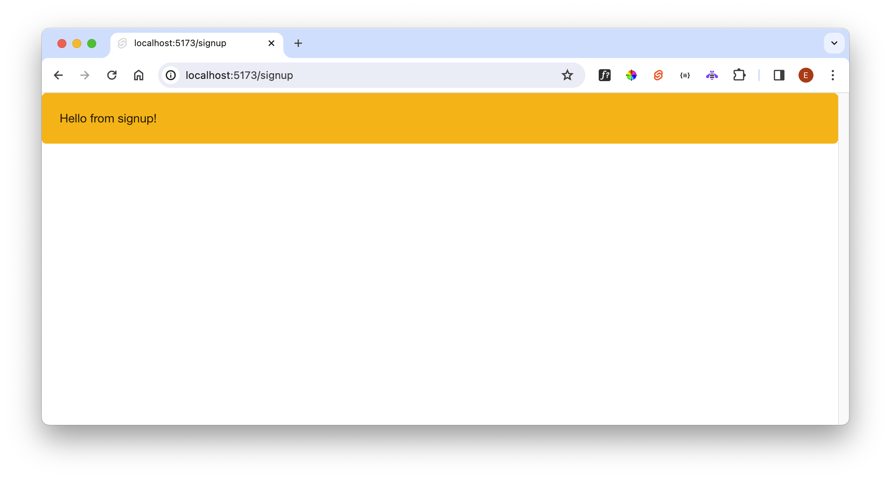
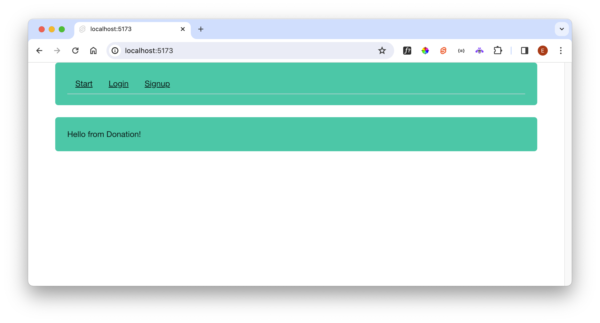

# Routes

Like our back-end application, the front-end can also have a router. In this instance, the routes will be handled by the front-end application, independent of any back-end that may be in use.

SvelteKit implements a file-based router, which means we don't need to create a routing table (like we have been doing in Hapi). Instead, SvelteKit infers the routing structure from the contents of a folder within the application.

Let's try it. Create these folders in the 'routes' folder:

- login
- signup

Inside these folders, create this modules:

### routes/login/+page.svelte

~~~html

  Hello from Login!

~~~

### routes/signup/+page.svelte

~~~html

  Hello from signup!

~~~

The project should look like this:

Make sure the app is running, and open these links (your port number may vary), and try each of these links:

- <http://localhost:5173>

- <http://localhost:5173/login>

- <http://localhost:5173/signup>

  

You should see the following:

As you can see, the router loads the page based on the url, where the final segment determines the Svelte component to load.

We could make the application dynamically load a page based on a link selected within the application. Introduce the following new file into the project:

### src/routes/+layout.svelte

~~~html

	

		<ul>
			<li><a href="/">Start</a></li>
			<li><a href="/login">Login</a></li>
			<li><a href="/signup">Signup</a></li>
		</ul>
	

	<slot />

~~~

This provides a rudimentary navigator, which will dynamically load each of the three pages as you select them from the menu.
