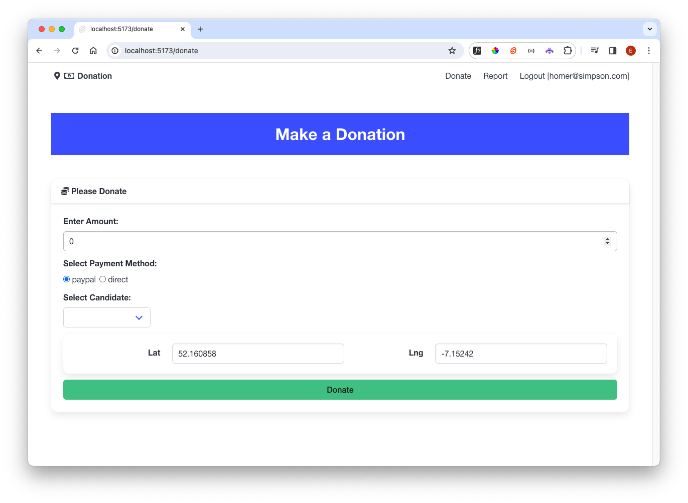
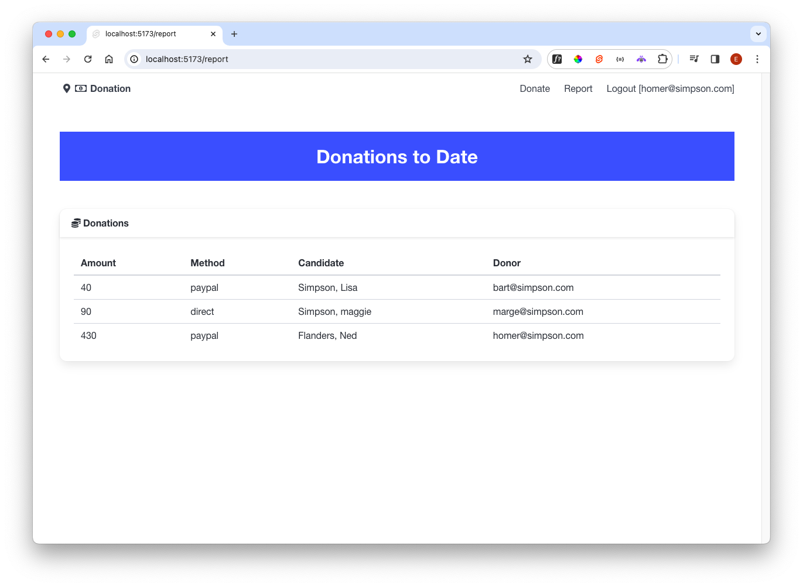

### Cards

Bulma, like most CSS frameworks, has a simple Card style:

- <https://bulma.io/documentation/components/card/>

We can develop our own Card component which will deploy this style into our Svelte components:

### src/lib/ui/Card.svelte

~~~html

  <header class="card-header">
    

      <i class="fas fa-coins"></i>{title}
    

  </header>
  

    

      <slot />
    

  

~~~

We are using the Bulma styles with a Card divided into header and content sections. The content section uses the Svelte `<slot>` mechanism:

- <https://svelte.dev/docs/special-elements>

- <https://svelte.dev/examples/slots>

Rework the donate and report routes now to use this Card:

### src/routes/donate/+page.svelte

~~~html

<Card title="Please Donate">
  <DonateForm />
</Card>
~~~

### src/routes/report/+page.svelte

~~~html

<Card title="Donations">
  <DonationList />
</Card>
~~~

