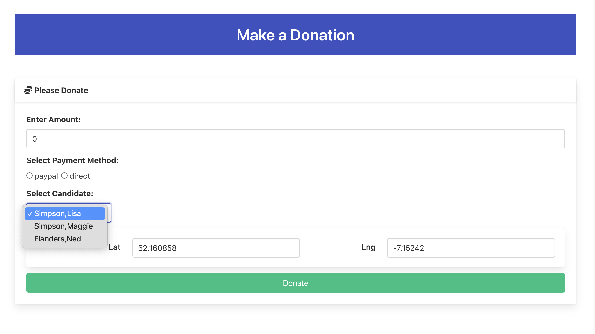

# Svelte: Candidate List

When the application starts up - we first need to request the latest candidate list from the server.

First we need to refactor DonationForm to accept the list of candidates as a property:

### src/routes/donate/DonateForm.svelte

~~~svelte
  //...
  import type { Candidate } from "$lib/types/donation-types";

  // const candidateList = [
  //   {
  //     firstName: "Lisa",
  //     lastName: "Simpson",
  //     office: "President"
  //   },
  //   {
  //     firstName: "Maggie",
  //     lastName: "Simpson",
  //     office: "President"
  //   },
  //   {
  //     firstName: "Ned",
  //     lastName: "Flanders",
  //     office: "President"
  //   }
  // ];

  let { candidateList = [] } = $props();
~~~

We can then rework the donation page to fetch the candidate list on load and pass this to the DonateForm

### src/routes/donate/+page.svelte

~~~html

<Card title="Please Donate">
  <DonateForm {candidateList} />
</Card>
~~~

The onMount function will be called once when this page is loaded. It will request the list of candidates from the api, storing them in the candidateList array. This is, in turn, passed to the DonateForm component.

Try the app now. We are not supporting donation yet, but the latest candidate list should appear in the drop down on the form:

