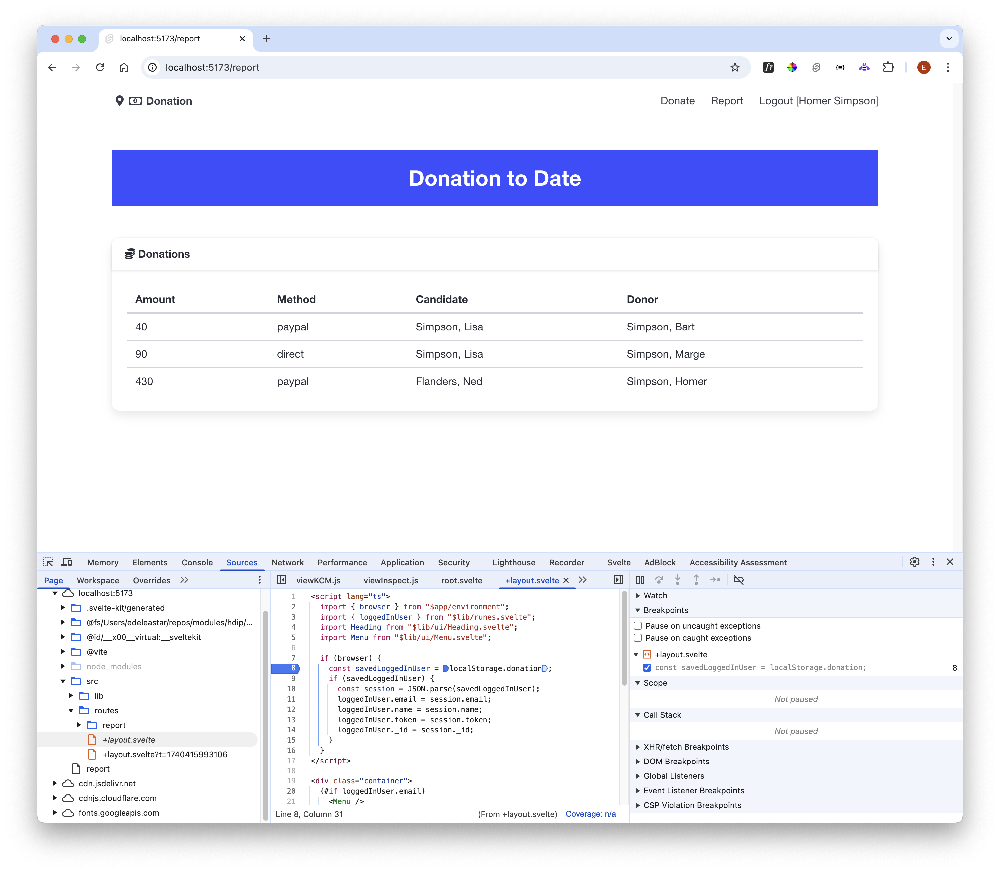

# Load Session

We have stored the session state when we log in:

~~~typescript
  //...
      localStorage.donation = JSON.stringify(session);
      goto("/donate");
  //...
~~~

Where do we read the session from local storage if our app has been reloaded?

There are multiple places we could test for this - one of the most convenient is the layout for all routes:

### src/routes/+layout.svelte

~~~html

  {#if loggedInUser.email}
    <Menu />
    <Heading />
  {/if}
  <slot />

~~~

Here is a new version:

~~~html

  {#if loggedInUser.email}
    <Menu />
    <Heading />
  {/if}
  <slot />

~~~

In the above we are first checking if we are running this code in a browser (more on this check later) - and then we examine local storage to see if we have stored session. If so, we retrieve it and set the currentSession store.

Log in and visit the report view - refreshing the page will this now reload the page successfully:

The final step is to clear the local storage when the user logs out:

### src/routes/logout/+page.svelte

~~~html

~~~

Verify that the donation local storage entry is created and destroyed successfully be examining the browser tools as you log in and log out.
