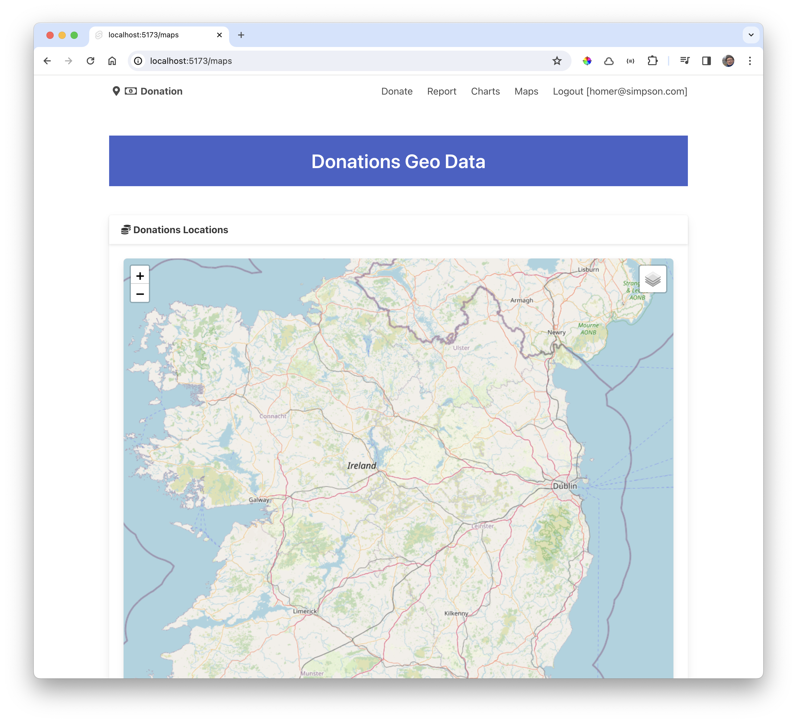

# Map Route

The new version of our server has seeded locations with each donation - so we can start by seeing if we can display these on a map.

Start with a new entry in menu entry:

### src/lib/ui/Menu.svelte

~~~html
        <a class="navbar-item" href="/maps"> Maps </a>
~~~

Create a new route/page to host to Map:

### routes/maps/+page.svelte

~~~html

<Card title="Donations Locations">
  <LeafletMap />
</Card>
~~~

The page should be available in the app now:

To prevent the map being truncated, set its height:

~~~html
  <LeafletMap height={60}/>
~~~

