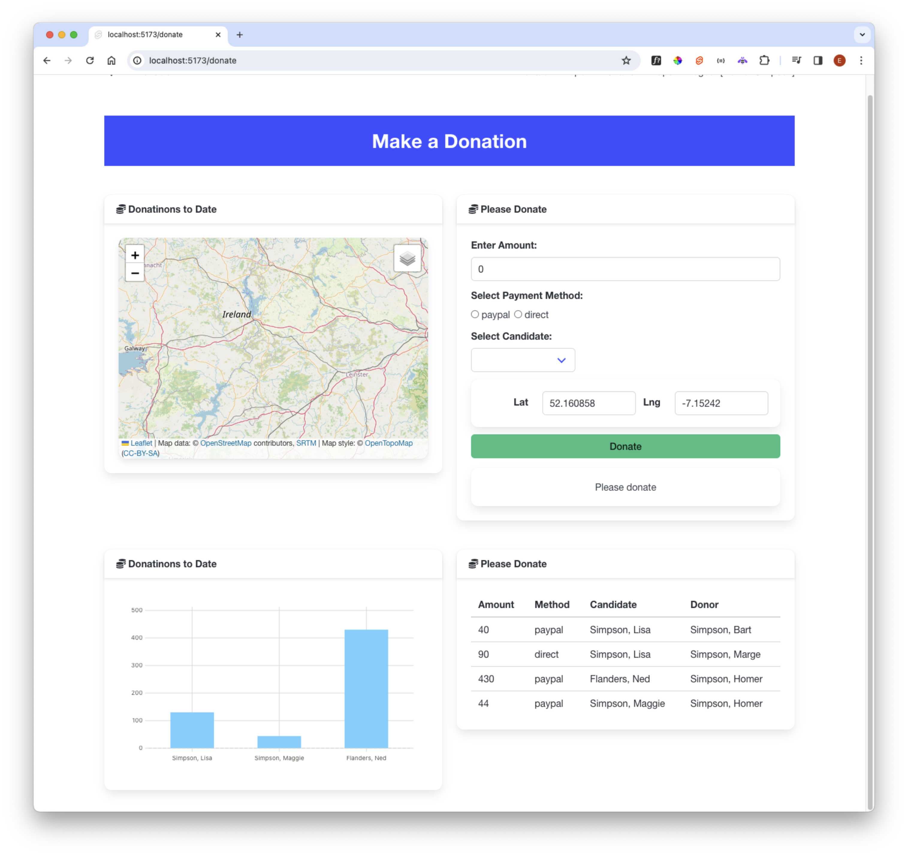

# Donation Dashboard

We will put these components to use now with a revised donation route:

The layout can be assembled like this:

### src/routes/donation/+page.svelte

~~~html

  

    <Card title="Donations to Date">
      <LeafletMap height={30} />
    </Card>
  

  

    <Card title="Please Donate">
      <DonateForm {candidateList} />
    </Card>
  

  

    <Card title="Donations to Date">
      <Chart data={donationsByCandidate} type="bar" />
    </Card>
  

  

    <Card title="Please Donate">
      <DonationList {donations} />
    </Card>
  

~~~

We will populate the map with markers in the next step.

