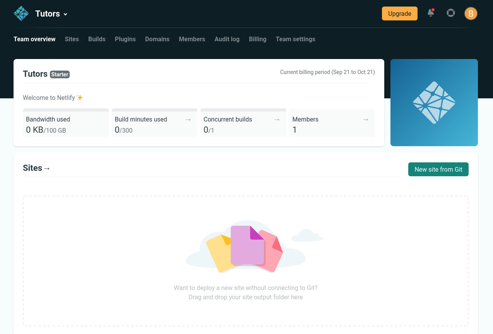
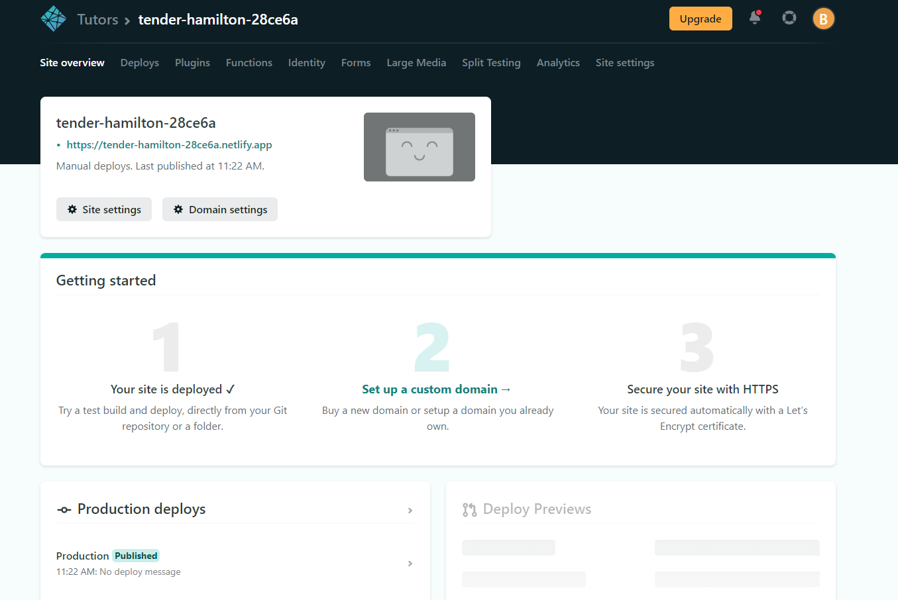
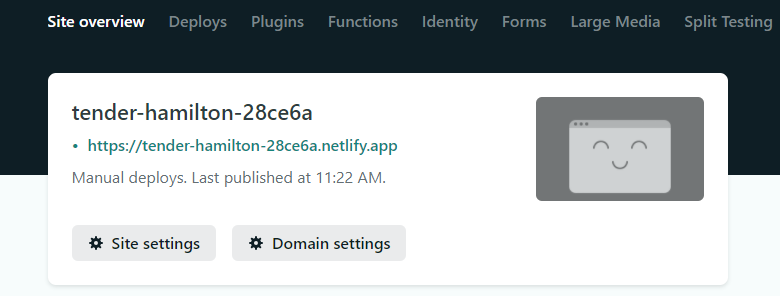

# Svelte

We have been using SvelteKit for the donation-svelte application series. However the Todo app from labs 12 and 13 was a simple svelte app.

The deploy the todo app, first package the app via this command:

~~~
npm run build
~~~

This will rebuild the application:

~~~bash
> todo-svelte@0.2.0 build
> vite build

vite v4.0.4 building for production...
✓ 24 modules transformed.
9:02:30 AM [vite-plugin-svelte] dom compile done.
package         files    time      avg
todo-svelte         4   0.29s   71.4ms
dist/index.html                0.47 kB
dist/assets/index-7a054ea5.js  9.22 kB │ gzip: 3.85 kB
~~~

This will generate a bundled version of the application into the **dist** folder in your project.

Now sign up for a free account on Netlify:

- <https://www.netlify.com/>

Once signed up - and logged in you should see something like this:

To deploy an app, drag and drop the **dist** folder to the drop zone above. This should deploy in a few seconds:

You can see under `Production Deploys` that the site has been published, click the link in the box at the top of the page.

The app should function as expected.

If you press the Domain Settings button you will be able to edit/change the default name (but not the domain).
