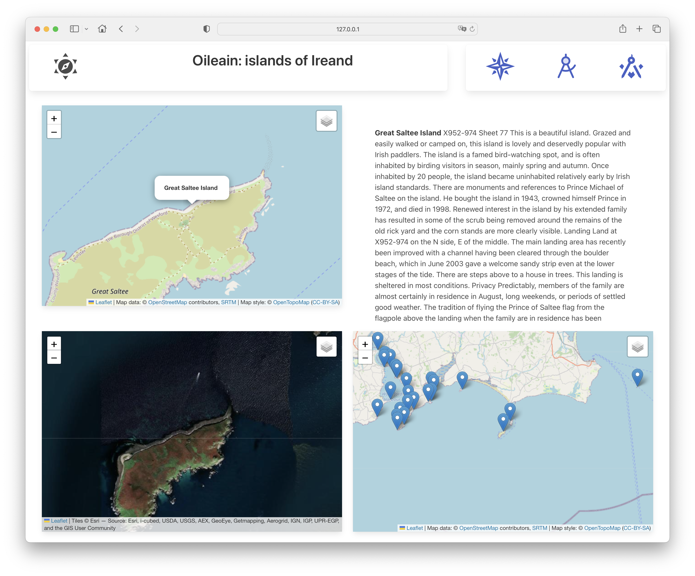

# Navigator

Lets try another experiment - a more complex view with three maps showing different aspects:

Like the poi route, this will also take a parameter, so include a '[id]' segment in the route:

### routes/navigator/[id]/+page.ts

~~~typescript
import { generateMarkerSpec } from "../../../services/oileain-utils";
import { oileainService } from "../../../services/oileain-service";
import type { PageLoad } from "./$types";

export const ssr = false;

export const load: PageLoad = async ({ params }) => {
	await oileainService.getCoasts();
	const island = await oileainService.getIslandById(encodeURI(params.id));
	const marker = generateMarkerSpec(island);
	return {
		island,
		marker,
		markerLayers: oileainService.markerLayers
	};
};
~~~

The load function here is returning an island, its marker, and the marker layers for the complete map to the view.

### routes/navigator/[id]/+page.svelte

~~~html

	

		<LeafletMap id="terrain" height={40} bind:this={mapTerrain} zoom={14} />
	

	

		<IslandDescription island={data.island} />
	

	

		<LeafletMap id="sat" activeLayer={"Satellite"} height={40} bind:this={mapSat} zoom={14} />
	

	

		<LeafletMap id="context" height={40} markerLayers={data.markerLayers} bind:this={mapContext} zoom={12} />
	

~~~

Currently our navigation is hard coded to a specific island:

- <http://127.0.0.1:5173/navigator/Great-Saltee-Island>

In the next step we will introduce a new mechanism to view any island via this route.
