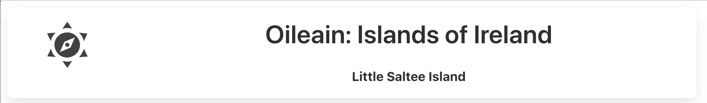

# Header

It would be useful to show the current island in the title bar like this:

This will change across multiple views, with each view providing a potentially different location where a new island can be selected. The simplest solution to have one item on screen potentially updated from a range of components is to use stores.

Introduce a new 'currentIsland' store:

### services/stores.ts

~~~typescript
...
import type { Island } from "./oileain-types";
...
export const currentIsland = writable<Island>();
...
~~~

In the Header component include the following adjustments:

~~~html

  ...
      

				
Oileain: Islands of Ireland

				{#if $currentIsland}
					{@html $currentIsland?.nameHtml}
				{:else}
					<b> Select a marker to explore island...</b>
				{/if}
			

  ...
~~~

We can then set the currentIsland store in each of the pages:

### routes/poi/[id]/+page.svelte

~~~typescript

~~~

### routes/explorer/[id]/+page.svelte

~~~typescript

~~~

### routes/navigator/[id]/+page.svelte

~~~typescript

~~~

### routes/+page.svelte

~~~typescript

...
~~~
