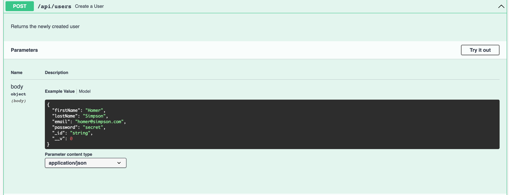
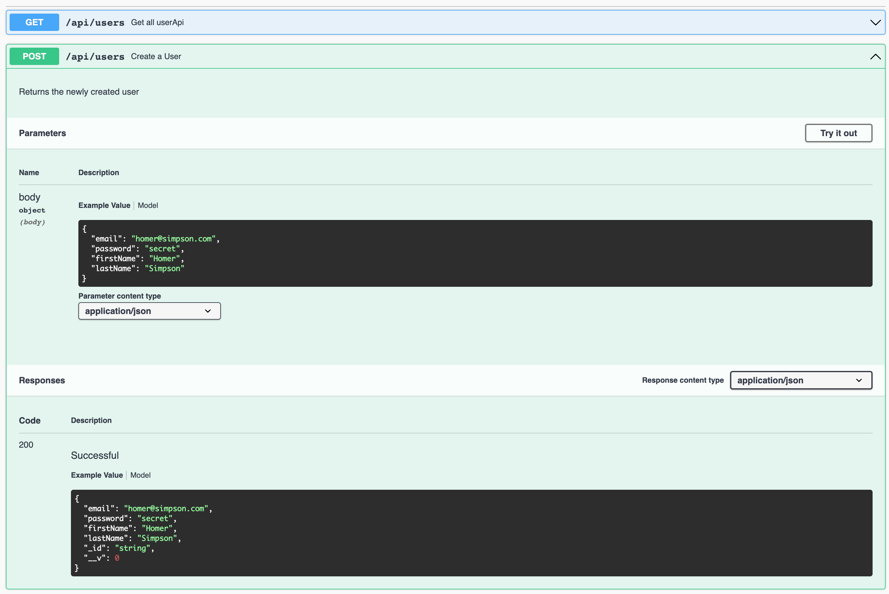
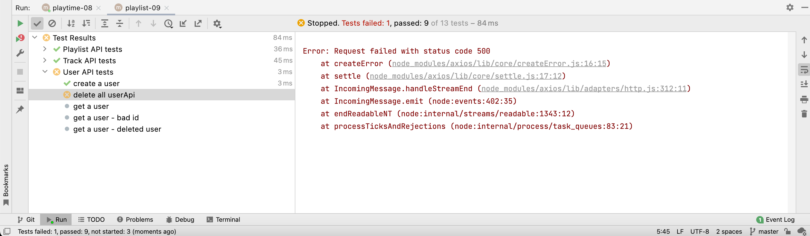

# User Schema

#### User

These are the schemas associated with Users currently:

~~~javascript
export const IdSpec = Joi.alternatives().try(Joi.string(), Joi.object()).description("a valid ID");

export const UserCredentialsSpec = {
  email: Joi.string().email().required(),
  password: Joi.string().required()
};

export const UserSpec = Joi.object()
  .keys({
    firstName: Joi.string().example("Homer").required(),
    lastName: Joi.string().example("Simpson").required(),
    email: Joi.string().email().example("homer@simpson.com").required(),
    password: Joi.string().example("secret").required(),
    _id: IdSpec,
    __v: Joi.number()
  })
  .label("UserDetails");

export const UserArray = Joi.array().items(UserSpec).label("UserArray");
~~~

Currently, when we inspect the API documentation we see an example for creating a user:

This is less than ideal - as we should not be expecting **_id** and **_v** properties when we are creating users

Here is a revised take on the User schemas:

~~~javascript
export const IdSpec = Joi.alternatives().try(Joi.string(), Joi.object()).description("a valid ID");

export const UserCredentialsSpec = Joi.object()
  .keys({
    email: Joi.string().email().example("homer@simpson.com").required(),
    password: Joi.string().example("secret").required(),
  })
  .label("UserCredentials");

export const UserSpec = UserCredentialsSpec.keys({
  firstName: Joi.string().example("Homer").required(),
  lastName: Joi.string().example("Simpson").required(),
}).label("UserDetails");

export const UserSpecPlus = UserSpec.keys({
  _id: IdSpec,
  __v: Joi.number(),
}).label("UserDetailsPlus");

export const UserArray = Joi.array().items(UserSpecPlus).label("UserArray");
~~~

In the above we are using inheritance - the UserSpec is an extension of UserCredentialsSpec - and UserSpecPlus is an extension of UserSpec.

We can reconfigure the API to use the additional schema correctly:

### user-api.js

~~~javascript
import Boom from "@hapi/boom";
import { db } from "../models/db.js";
import { UserSpec, UserSpecPlus, IdSpec, UserArray } from "../models/joi-schemas.js";
import { validationError } from "./logger.js";

export const userApi = {
  find: {
    auth: false,
    handler: async function (request, h) {
      try {
        const users = await db.userStore.getAllUsers();
        return users;
      } catch (err) {
        return Boom.serverUnavailable("Database Error");
      }
    },
    tags: ["api"],
    description: "Get all userApi",
    notes: "Returns details of all userApi",
    response: { schema: UserArray, failAction: validationError },
  },

  findOne: {
    auth: false,
    handler: async function (request, h) {
      try {
        const user = await db.userStore.getUserById(request.params.id);
        if (!user) {
          return Boom.notFound("No User with this id");
        }
        return user;
      } catch (err) {
        return Boom.serverUnavailable("No User with this id");
      }
    },
    tags: ["api"],
    description: "Get a specific user",
    notes: "Returns user details",
    validate: { params: { id: IdSpec }, failAction: validationError },
    response: { schema: UserSpecPlus, failAction: validationError },
  },

  create: {
    auth: false,
    handler: async function (request, h) {
      try {
        const user = await db.userStore.addUser(request.payload);
        if (user) {
          return h.response(user).code(201);
        }
        return Boom.badImplementation("error creating user");
      } catch (err) {
        return Boom.serverUnavailable("Database Error");
      }
    },
    tags: ["api"],
    description: "Create a User",
    notes: "Returns the newly created user",
    validate: { payload: UserSpec, failAction: validationError },
    response: { schema: UserSpecPlus, failAction: validationError },
  },

  deleteAll: {
    auth: false,
    handler: async function (request, h) {
      try {
        await db.userStore.deleteAll();
        return h.response().code(204);
      } catch (err) {
        return Boom.serverUnavailable("Database Error");
      }
    },
    tags: ["api"],
    description: "Delete all userApi",
    notes: "All userApi removed from Playtime",
  },
};
~~~

The POST api endpoint should now have more appropriate documentation:

The above changes will, however, break our tests:

Looking at the console we see an error coming from the logger:

~~~bash
"_id" is not allowed
~~~

This is a result of some lack of test isolation in our setup:

~~~javasc
  setup(async () => {
    await playtimeService.deleteAllUsers();
    for (let i = 0; i < testUsers.length; i += 1) {
      // eslint-disable-next-line no-await-in-loop
      testUsers[0] = await playtimeService.createUser(testUsers[i]);
    }
  });
~~~

The testUsers array, on the second run, will have the _id and _v fields populated. This will in turn break some of the tests, as we will be attempting to create a user including these fields. The simplest solution is to declare a separate array called users:

~~~javascript
const users = new Array(testUsers.length);
~~~

And use this array to hold the result of creating the test users in the setup. In this way, the test fixtures will be isolated from each run of the tests. Here is the revised test to accomplish this:

### users-api-tests.js

~~~javascript
import { assert } from "chai";
import { assertSubset } from "../test-utils.js";
import { playtimeService } from "./playtime-service.js";
import { maggie, testUsers } from "../fixtures.js";
import { db } from "../../src/models/db.js";

const users = new Array(testUsers.length);

suite("User API tests", () => {
  setup(async () => {
    await playtimeService.deleteAllUsers();
    for (let i = 0; i < testUsers.length; i += 1) {
      // eslint-disable-next-line no-await-in-loop
      users[0] = await playtimeService.createUser(testUsers[i]);
    }
  });
  teardown(async () => {});

  test("create a user", async () => {
    const newUser = await playtimeService.createUser(maggie);
    assertSubset(maggie, newUser);
    assert.isDefined(newUser._id);
  });

  test("delete all userApi", async () => {
    let returnedUsers = await playtimeService.getAllUsers();
    assert.equal(returnedUsers.length, 3);
    await playtimeService.deleteAllUsers();
    returnedUsers = await playtimeService.getAllUsers();
    assert.equal(returnedUsers.length, 0);
  });

  test("get a user", async () => {
    const returnedUser = await playtimeService.getUser(users[0]._id);
    assert.deepEqual(users[0], returnedUser);
  });

  test("get a user - bad id", async () => {
    try {
      const returnedUser = await playtimeService.getUser("1234");
      assert.fail("Should not return a response");
    } catch (error) {
      assert(error.response.data.message === "No User with this id");
      // assert.equal(error.response.data.statusCode, 503);
    }
  });

  test("get a user - deleted user", async () => {
    await playtimeService.deleteAllUsers();
    try {
      const returnedUser = await playtimeService.getUser(users[0]._id);
      assert.fail("Should not return a response");
    } catch (error) {
      assert(error.response.data.message === "No User with this id");
      assert.equal(error.response.data.statusCode, 404);
    }
  });
});
~~~

The tests should all pass now.
