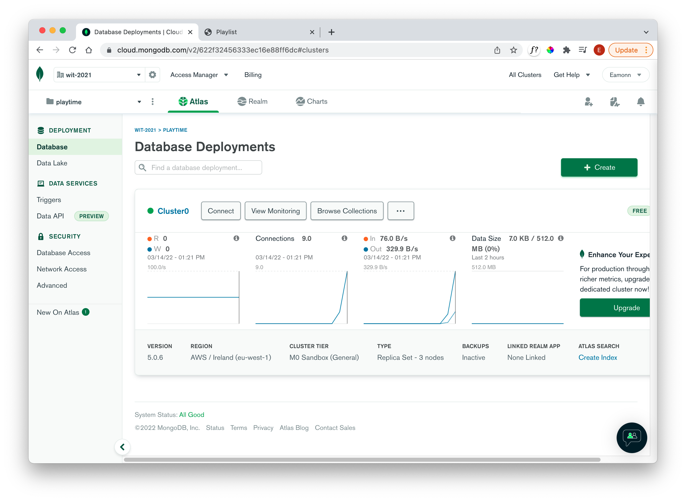
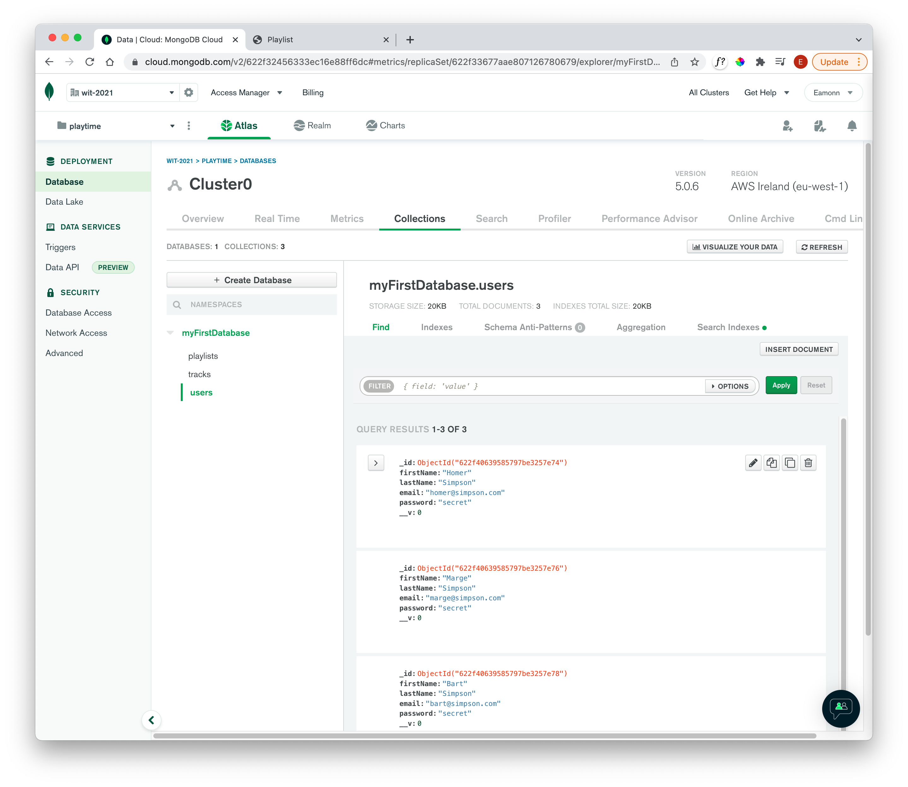

# Exercises

### Exercise 1

If you are seeding the database, then you should be able to log in to the running app now as one of the test users, exploring the associated playlists/tracks

### Exercise 2

Explore the test data from the Cloud Atlas console via the **Browse Collections** panel:

