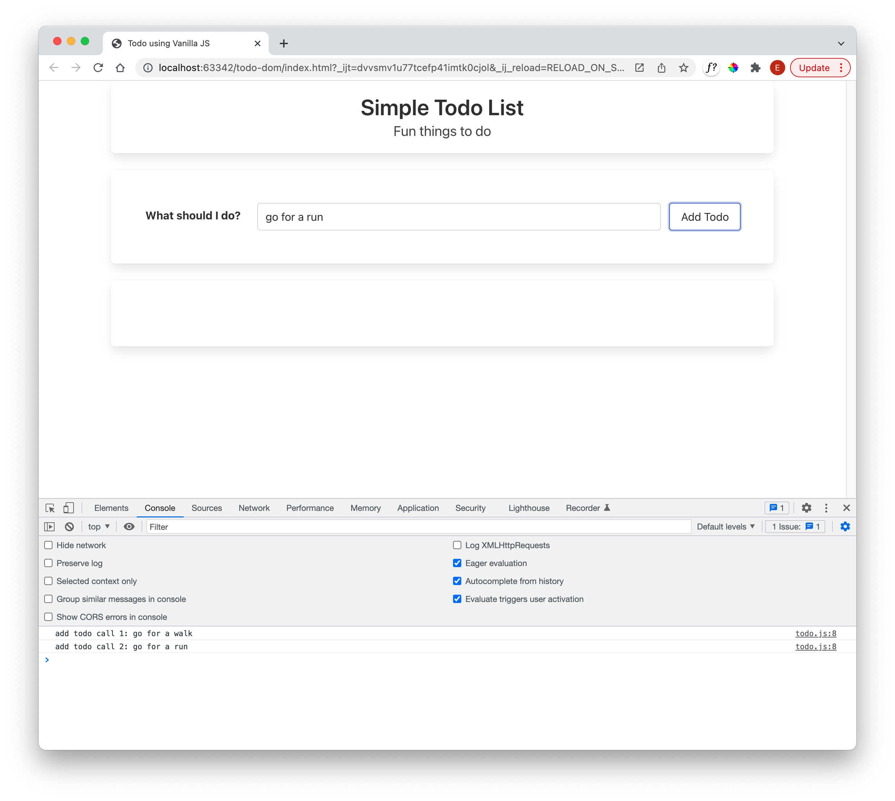
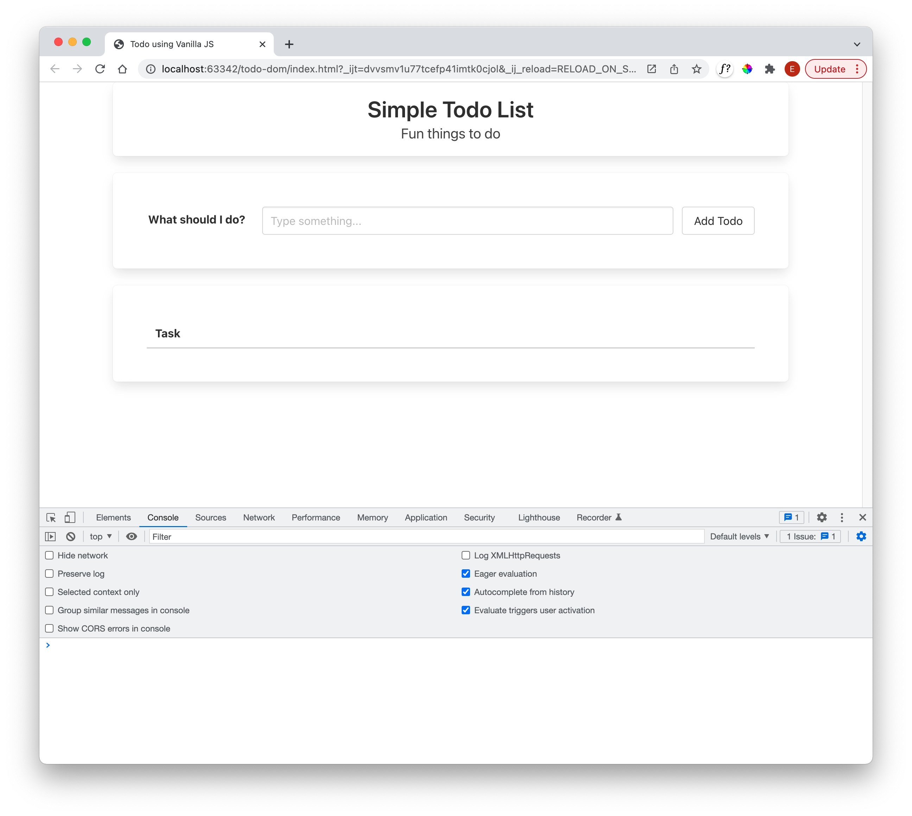
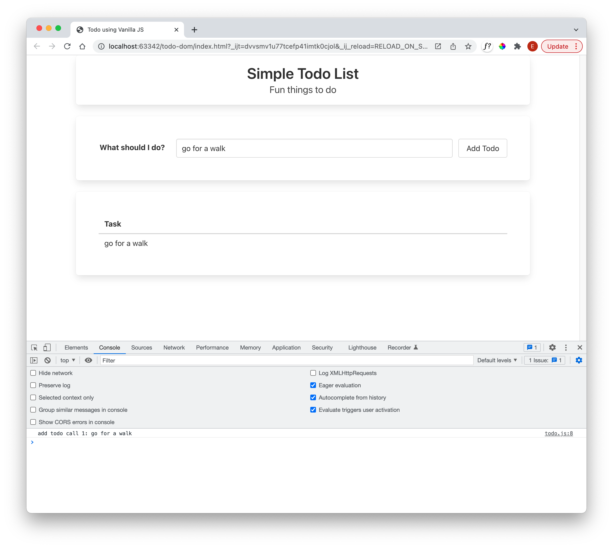
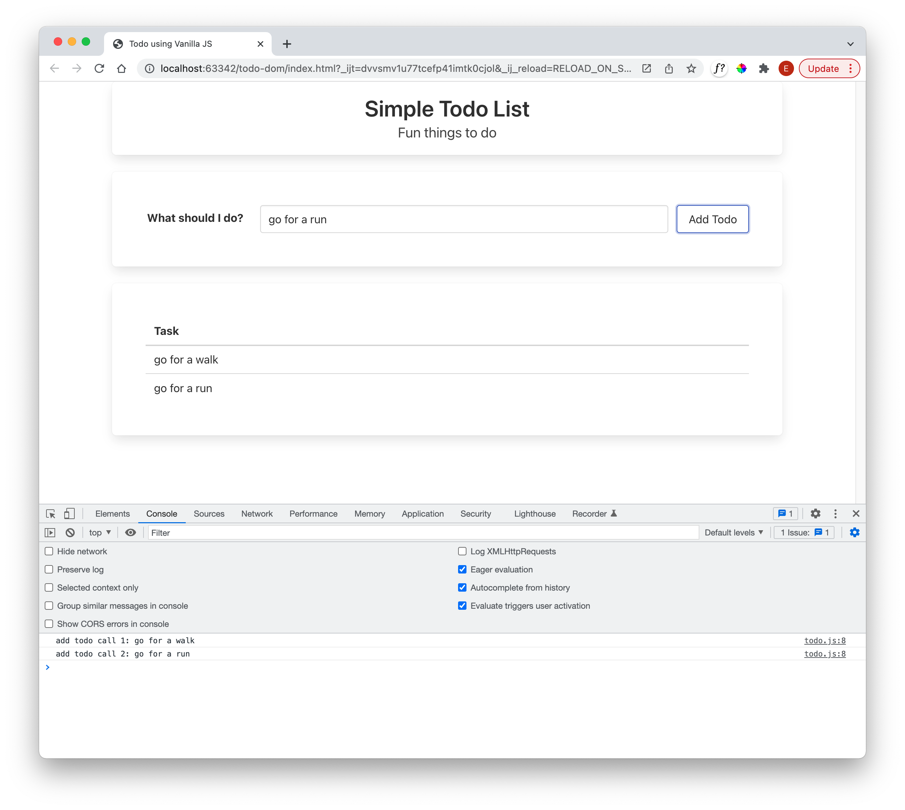
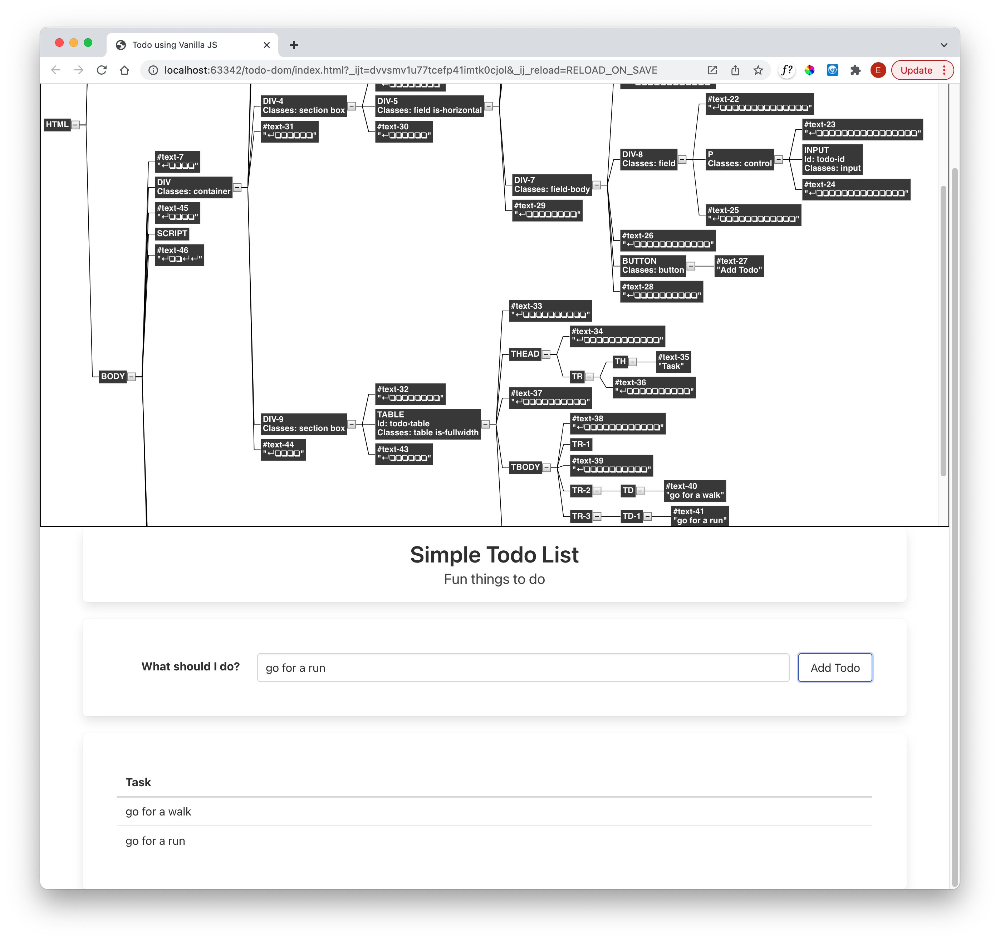

# DOM Access

In index.html, modify the `<input>` element it include an id attribute:

~~~html
  <input id="todo-id" class="input" type="text" placeholder="Type something...">
~~~

Now try this version of addTodo()

~~~javascript
function addTodo() {
  count++;
  const todoText = document.getElementById("todo-id").value;
  console.log(`add todo call ${count}: ${todoText}`)
}
~~~

Note that we are retrieving the element entered into the text field, and outputting to the console:

Any text we enter, and pressing the button again will cause the new text to be logged.

We could also add the text to the DOM. Try this: introduce a new table into the second section box:

~~~html
      

        <table id="todo-table" class="table is-fullwidth">
          <thead>
            <th>Task</th>
          </thead>
          <tbody>
            <tr></tr>
          </tbody>
        </table>
      

~~~

The table is empty initially, but we can modify addTodo() to populate it:

~~~javascript
function addTodo() {
  count++;
  const todoText = document.getElementById("todo-id").value;
  console.log(`add todo call ${count}: ${todoText}`)

  const table = document.getElementById("todo-table");
  const row = table.insertRow(-1);
  const textCell = row.insertCell(0);
  textCell.innerText = todoText;
}
~~~

The DOM API we are using is documented here:

- [HTML Table Element](https://developer.mozilla.org/en-US/docs/Web/API/HTMLTableElement)
- [Insert Row function](https://developer.mozilla.org/en-US/docs/Web/API/HTMLTableElement/insertRow)

The code above will append onto the end of the table - so another element will appear below the first:

If you are using Chrome - you can install tools to let you visualise the DOM. Try this one for example:
 - [Dom tree node viewer](https://chrome.google.com/webstore/detail/dom-node-tree-viewer/jbplakkefflidgnjhckoahendgekokfc?hl=en)

Using the above might show this:

