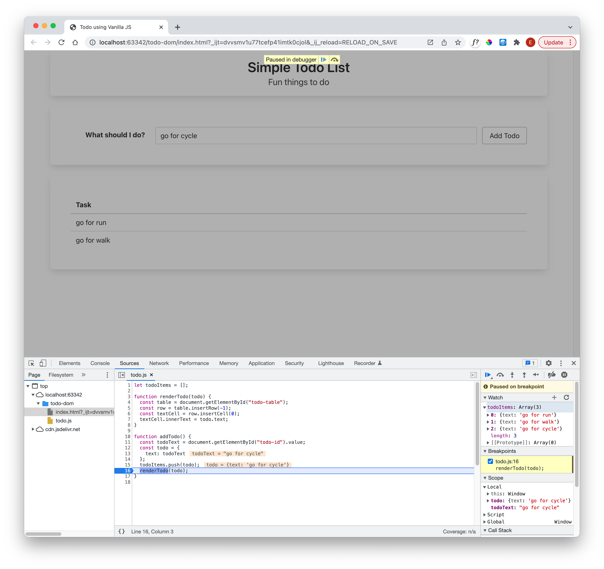

# Refactor + Debug

Replace the current contents of todo-js.js with the following:

~~~javascript
let todoItems = [];

function renderTodo(todo) {
  const table = document.getElementById("todo-table");
  const row = table.insertRow(-1);
  const textCell = row.insertCell(0);
  textCell.innerText = todo.text;
}

function addTodo() {
  const todoText = document.getElementById("todo-id").value;
  const todo = {
    text: todoText
  };
  todoItems.push(todo);
  renderTodo(todo);
}
~~~

Try it out now - it should work as before. Read the code carefully - notice we are creating a todo object, which contains a text field. Also, we are `rendering` the todo object using a separate function.

In a browser - set a breakpoint to explore the contents of the todoItems array.

In the above, as the todoItems object is global, we have to add it to the `watch` panel to explore it (having first set a breakpoint in the script).
