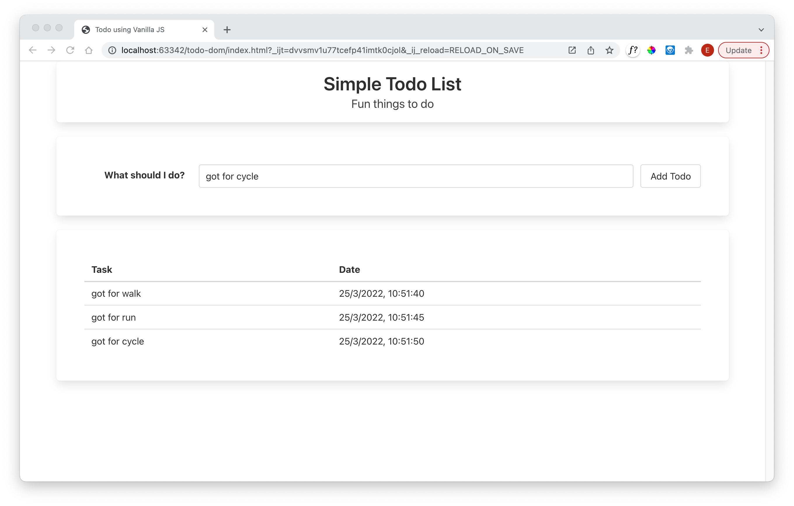

# Exercise Solution

## Exercise 1

In Javascript, the current date is available via the Date object:

- [Date Object](https://developer.mozilla.org/en-US/docs/Web/JavaScript/Reference/Global_Objects/Date)

Extend the todo object to include the current date, and incorporate the date into a new column in the table. The application should look like this:

## Solution

First extend the table to include an additional column:

## index.html

~~~html
        <thead>
          <tr>
            <th>Task</th>
            <th>Date</th>
          </tr>
        </thead>
~~~

## todo.js

~~~javascript
let todoItems = [];

function renderTodo(todo) {
  const table = document.getElementById("todo-table");
  const row = table.insertRow(-1);
  const textCell = row.insertCell(0);
  textCell.innerText = todo.text;
  const dateCell = row.insertCell(1);
  dateCell.innerText = todo.date;
}

function addTodo() {
  const todoText = document.getElementById("todo-id").value;
  const todo = {
    text: todoText,
    date: new Date().toLocaleString("en-IE"),
  };
  todoItems.push(todo);
  renderTodo(todo);
}
~~~