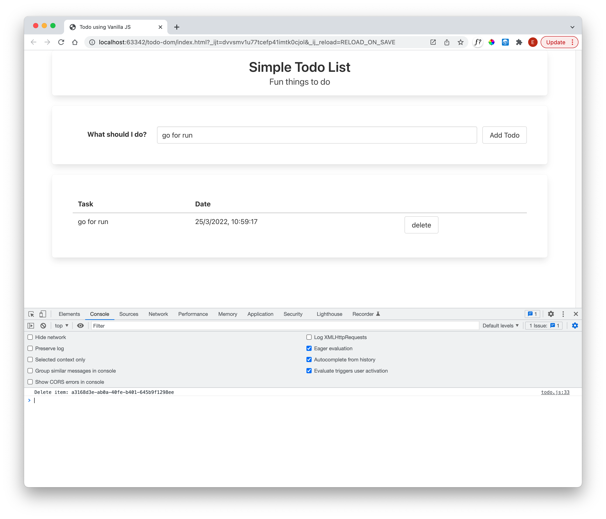
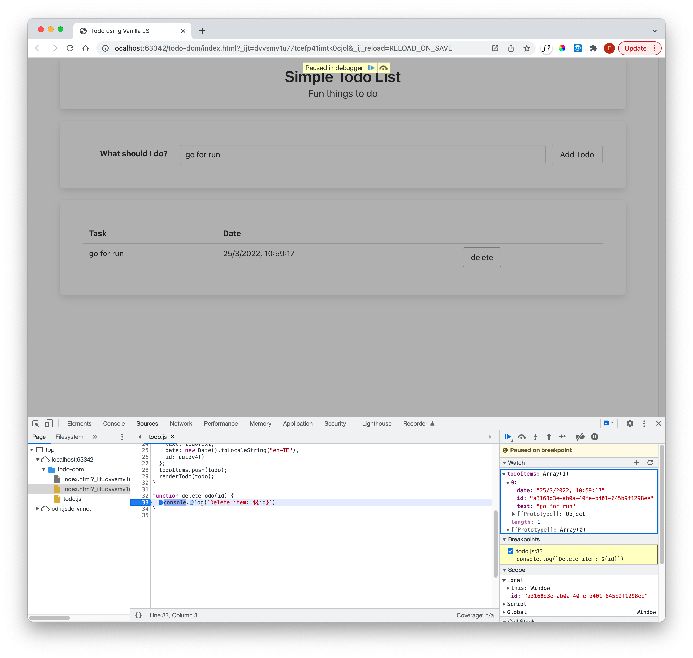
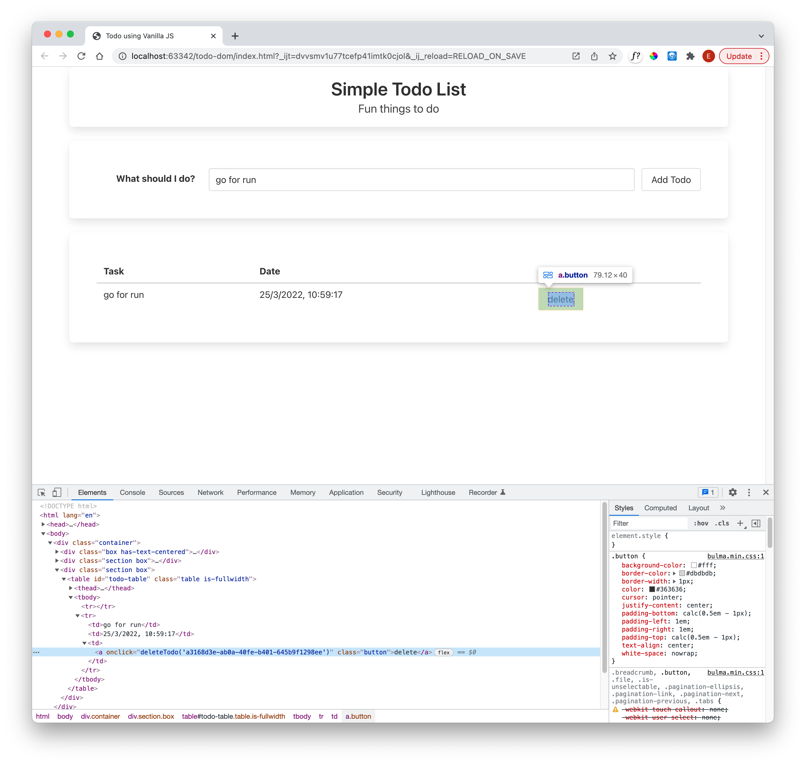

# Delete Event Handler

Introduce a new delete todo function:

~~~javascript
function deleteTodo(id) {
  console.log(`Delete item: ${id}`)
}
~~~

Now we need to change extend the button to trigger the event:

~~~html
  deleteCell.innerHTML = `<a onclick="deleteTodo('${todo.id}')" class="button">delete</a>`;
~~~

There quotation marks used in the above are very carefully assembled to ensure the correct sequences appear in the generated html. Deleting now should log the id to the console:

... and the ID should correlate with the item you wish to delete:

Inspecting the element:

notice that the actual id is embedded within the delete button.
