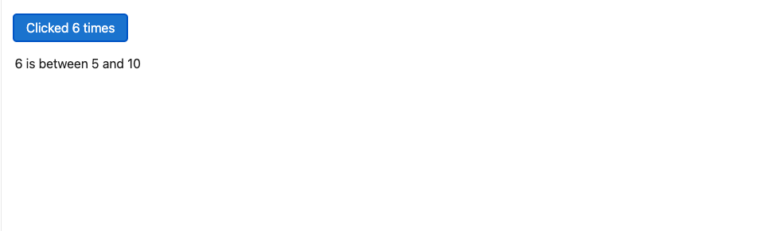
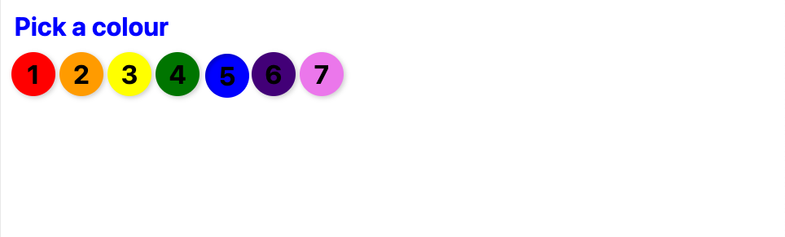
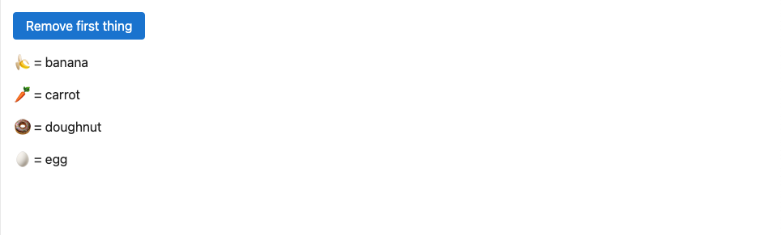
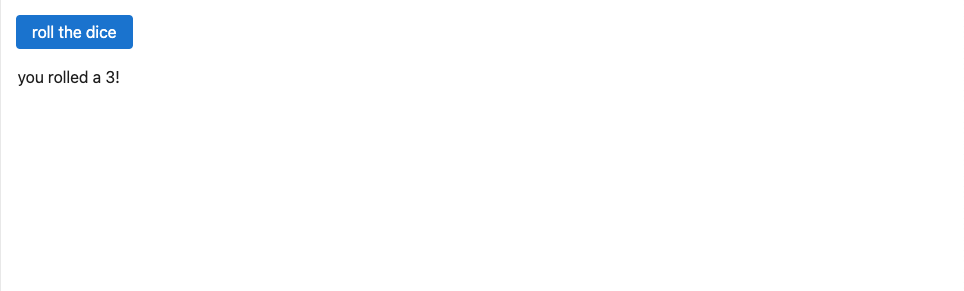

# Logic

## If blocks

HTML doesn't have a way of expressing _logic_, like conditionals and loops. Svelte does.

To conditionally render some markup, we wrap it in an `if` block. Let's add some text that appears when `count` is greater than `10`:

~~~svelte
<button onclick={increment}>
  Clicked {count}
  {count === 1 ? 'time' : 'times'}
</button>

{#if count > 10}
  
{count} is greater than 10

{/if}
~~~

#### App.svelte

~~~svelte

<button onclick={increment}>
  Clicked {count}
  {count === 1 ? 'time' : 'times'}
</button>

{#if count > 10}
  
{count} is greater than 10

{/if}
~~~

## Else blocks

Just like in JavaScript, an `if` block can have an `else` block:

~~~svelte
{#if count > 10}
  
{count} is greater than 10

{:else}
  
{count} is between 0 and 10

{/if}
~~~

`{#...}` opens a block. `{/...}` closes a block. `{:...}` _continues_ a block. Congratulations — you've already learned almost all the syntax Svelte adds to HTML.

#### App.svelte

~~~svelte

<button onclick={increment}>
  Clicked {count}
  {count === 1 ? 'time' : 'times'}
</button>

{#if count > 10}
  
{count} is greater than 10

{:else}
  
{count} is between 0 and 10

{/if}
~~~

## Else-if blocks

Multiple conditions can be 'chained' together with `else if`:

~~~svelte

{#if count > 10}
  
{count} is greater than 10

{:else if count < 5}
  
{count} is less than 5

{:else}
  
{count} is between 5 and 10

{/if}
~~~

~~~svelte

<button onclick={increment}>
  Clicked {count}
  {count === 1 ? 'time' : 'times'}
</button>

{#if count > 10}
  
{count} is greater than 10

{:else if count < 5}
  
{count} is less than 5

{:else}
  
{count} is between 5 and 10

{/if}
~~~

## Each blocks

When building user interfaces you'll often find yourself working with lists of data. In this exercise, we've repeated the `<button>` markup multiple times — changing the colour each time — but there's still more to add.

Instead of laboriously copying, pasting and editing, we can get rid of all but the first button, then use an `each` block:

~~~svelte

  {#each colors as color}
    <button
      style="background: red"
      aria-label="red"
      aria-current={selected === 'red'}
      onclick={() => selected = 'red'}
    ></button>
  {/each}

~~~

> [!NOTE] The expression (`colors`, in this case) can be any iterable or array-like object — in other words, anything that works with [`Array.from`](https://developer.mozilla.org/en-US/docs/Web/JavaScript/Reference/Global_Objects/Array/from).

Now we need to use the `color` variable in place of `"red"`:

~~~svelte

  {#each colors as color}
    <button
      style="background: {color}"
      aria-label={color}
      aria-current={selected === color}
      onclick={() => selected = color}
    ></button>
  {/each}

~~~

You can get the current _index_ as a second argument, like so:

~~~svelte

  {#each colors as color, i}
    <button
      style="background: {color}"
      aria-label={color}
      aria-current={selected === color}
      onclick={() => selected = color}
    >{i + 1}</button>
  {/each}

~~~

### App.svelte

~~~svelte

<h1 style="color: {selected}">Pick a colour</h1>

  {#each colors as color, i}
    <button
      style="background: {color}"
      aria-label={color}
      aria-current={selected === color}
      onclick={() => selected = color}
    >{i + 1}</button>
  {/each}

~~~

## Keyed each blocks

By default, when you modify the value of an `each` block, it will add and remove DOM nodes at the _end_ of the block, and update any values that have changed. That might not be what you want.

It's easier to show why than to explain. Inside `Thing.svelte`, `name` is a dynamic prop but `emoji` is a constant.

Click the 'Remove first thing' button a few times, and notice what happens:

1. It removes the last component.
2. It then updates the `name` value in the remaining DOM nodes, but not the emoji.

> [!NOTE] If you're coming from React, this might seem strange, because you're used to the entire component re-rendering when state changes. Svelte works differently: the component 'runs' once, and subsequent updates are 'fine-grained'. This makes things faster and gives you more control.

One way to fix it would be to make `emoji` a [`$derived`](derived-state) value. But it makes more sense to remove the first `<Thing>` component altogether rather than remove the _last_ one and update all the others.

To do that, we specify a unique _key_ for each iteration of the `each` block:

~~~svelte
{#each things as thing (thing.id)}
  <Thing name={thing.name}/>
{/each}
~~~

> [!NOTE] You can use any object as the key, as Svelte uses a `Map` internally — in other words you could do `(thing)` instead of `(thing.id)`. Using a string or number is generally safer, however, since it means identity persists without referential equality, for example when updating with fresh data from an API server.

#### Thing.svelte

~~~svelte

{emoji} = {name}

~~~

#### App.svelte

~~~svelte

<button onclick={() => things.shift()}>
  Remove first thing
</button>

{#each things as thing (thing.id)}
  <Thing name={thing.name} />
{/each}
~~~

## Await blocks

Most web applications have to deal with asynchronous data at some point. Svelte makes it easy to _await_ the value of [promises](https://developer.mozilla.org/en-US/docs/Web/JavaScript/Guide/Using_promises) directly in your markup:

~~~svelte
{#await promise}
  
...rolling

{:then number}
  
you rolled a {number}!

{:catch error}
  
{error.message}

{/await}
~~~

> [!NOTE] Only the most recent `promise` is considered, meaning you don't need to worry about race conditions.

If you know that your promise can't reject, you can omit the `catch` block. You can also omit the first block if you don't want to show anything until the promise resolves:

~~~svelte
{#await promise then number}
  
you rolled a {number}!

{/await}
~~~

#### utils.js

~~~javascript
export async function roll() {
  // Fetch a random number from 1 to 6
  // (with a delay, so that we can see it)
  return new Promise((fulfil, reject) => {
    setTimeout(() => {
      // simulate a flaky network
      if (Math.random() < 0.3) {
        reject(new Error('Request failed'));
        return;
      }

      fulfil(Math.ceil(Math.random() * 6));
    }, 1000);
  });
}
~~~

#### App.svelte

~~~svelte

<button onclick={() => promise = roll()}>
  roll the dice
</button>

{#await promise}
  
...rolling

{:then number}
  
you rolled a {number}!

{:catch error}
  
{error.message}

{/await}
~~~

