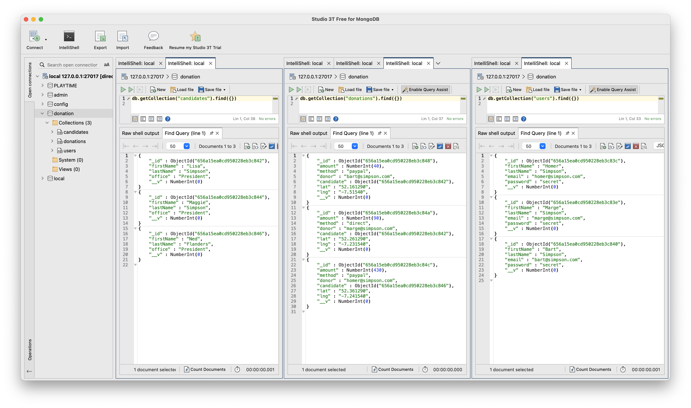

# Seed Data

To verify that we have defined these new models objects correctly, the database seeding mechanism can be useful first port of call. Here we define **candidates** and **donations** sample data in addition to the users:

### seed-data.js

~~~javascript
export const seedData = {
  users: {
    _model: "User",
    homer: {
      firstName: "Homer",
      lastName: "Simpson",
      email: "homer@simpson.com",
      password: "secret",
    },
    marge: {
      firstName: "Marge",
      lastName: "Simpson",
      email: "marge@simpson.com",
      password: "secret",
    },
    bart: {
      firstName: "Bart",
      lastName: "Simpson",
      email: "bart@simpson.com",
      password: "secret",
    },
  },
  candidates: {
    _model: "Candidate",
    lisa: {
      firstName: "Lisa",
      lastName: "Simpson",
      office: "President",
    },
    donald: {
      firstName: "Donald",
      lastName: "Simpson",
      office: "President",
    },
  },
  donations: {
    _model: "Donation",
    one: {
      amount: 40,
      method: "paypal",
      donor: "bart@simpson.com",
      candidate: "->candidates.lisa",
      lat: "52.161290",
      lng: "-7.51540",
    },
    two: {
      amount: 90,
      method: "direct",
      donor: "marge@simpson.com",
      candidate: "->candidates.lisa",
      lat: "52.261290",
      lng: "-7.231540",
    },
    three: {
      amount: 430,
      method: "paypal",
      donor: "homer@simpson.com",
      candidate: "->candidates.donald",
      lat: "52.361290",
      lng: "-7.241540",
    },
  },
};
~~~

If the app restarts successfully, we can explore the the models directly in Studio 3T to see if the object relationships are correctly instantiated:

