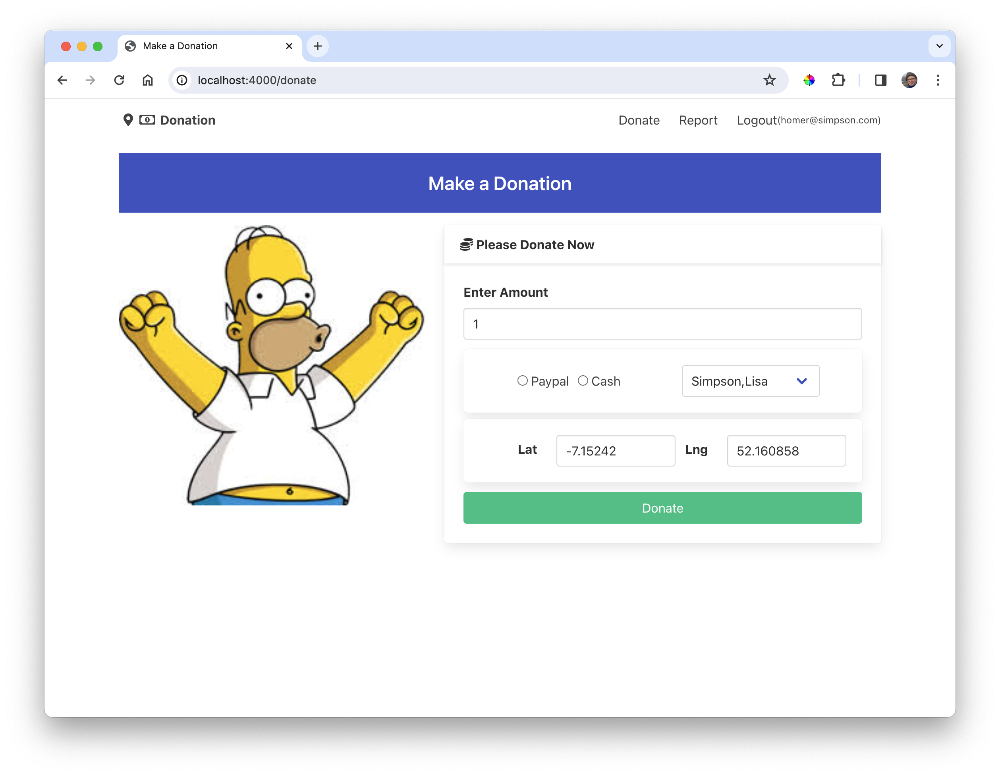
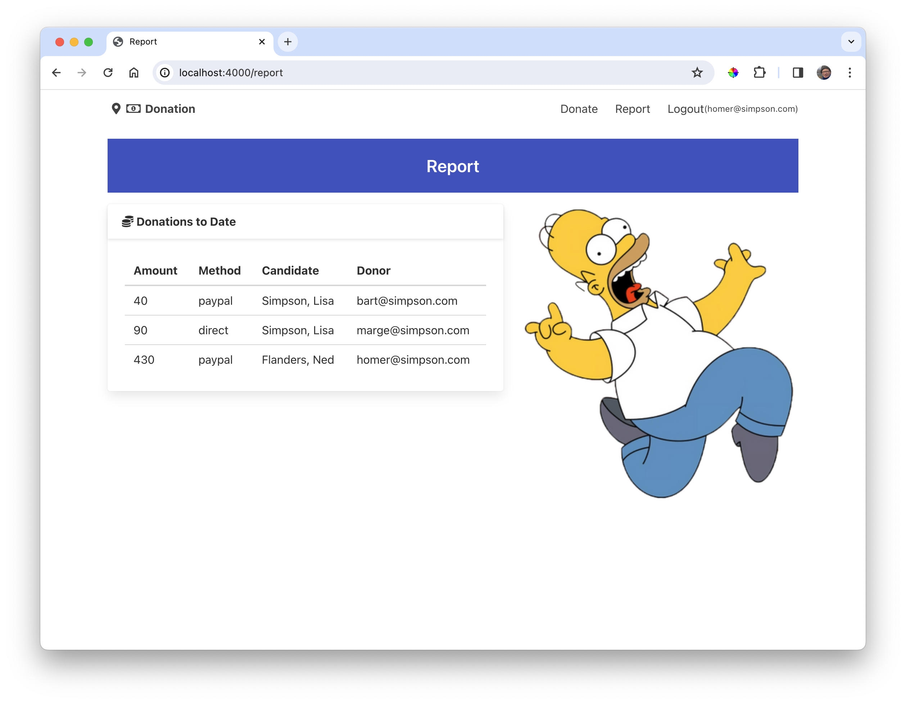

# Routes/Controller

We need 2 additional routes:

### src/web-routes.js

~~~javascript
  { method: "POST", path: "/donate", config: donationsController.donate },
  { method: "GET", path: "/report", config: donationsController.report },
~~~

Now extend the Donations controller with two additional actions:

### src/controllers/donations-controller.js

~~~javascript
  //...
  donate: {
    handler: async function (request, h) {
      try {
        const loggedInUser = request.auth.credentials;
        const donationPayload = request.payload;
        const donation = {
          amount: donationPayload.amount,
          method: donationPayload.method,
          donor: loggedInUser.email,
          candidate: donationPayload.candidate,
          lat: donationPayload.lat,
          lng: donationPayload.lng,
        };
        await db.donationStore.add(donation);

        return h.redirect("/donate");
      } catch (err) {
        return h.view("main", { errors: [{ message: err.message }] });
      }
    },
  },
  report: {
    handler: async function (request, h) {
      const loggedInUser = request.auth.credentials;
      const donations = await db.donationStore.find();
      return h.view("Report", {
        title: "Report",
        user: loggedInUser,
        donations: donations,
      });
    },
  },
  //...    
~~~

The app should be functional now:

