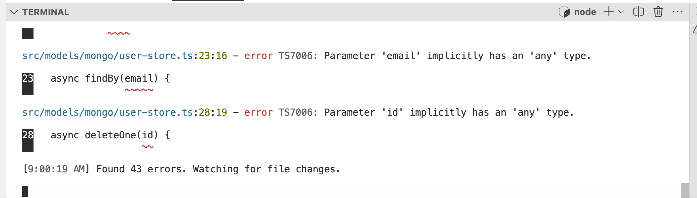

# TypeScript Controllers

### TypeScript Strict Mode

Currently we have no typescript in our (renamed) ts files. This is largely because we have a very permissive setting for our TypeScript complier:

### tsconfig.json

~~~json
    "strict": false,
~~~

Change this now:

~~~json
    "strict": true,
~~~

This will immediately trigger 40+ errors:

Most of these errors relate to function parameter types, which are currently unspecified. Change this back to `false` for the moment. 

Let's start with the controllers.

### src/controllers/accounts-controller.ts

A handler functions typically look like this:

~~~typescript
    handler: function (request, h) {
      return h.view("Main", { title: "Welcome to Donation" });
    },
~~~

This is a function expected by the Hapi library, so we expect the types to be available from the Hapi/types we installed in the last step.

At the top of the module import these types:

~~~typescript
import { Request, ResponseToolkit } from "@hapi/hapi";
~~~

This is a handler with the correct parameters:

~~~typescript
    handler: async function (request: Request, h: ResponseToolkit) {
      return h.view("Main", { title: "Welcome to Donation" });
    },
~~~

Change all of the handler functions to this signature now. Making this change will trigger some errors:

~~~bash
src/controllers/accounts-controller.ts:34:22 - error TS2339: Property 'password' does not exist on type 'string | object | Readable | Buffer'.

34       const { email, password } = request.payload;

Found 2 errors. Watching for file changes.              
~~~

For some errors, we can start to ease our way into TypeScript gradually. The `any` type is a handy way to do this - allowing us to adopt types, but postpone being specific for the moment. This line here is causing an error:

~~~typescript
      const { email, password } = request.payload;
~~~

Replace with :

~~~typescript
      const { email, password } = request.payload as any
~~~

The validate function (not a handler) signature looks like this:

~~~typescript
  async validate(request, session) {
~~~

We can partially specify the parameters if we are unsure of all the types:

~~~typescript
  async validate(request: Request, session: any) {
~~~

It the above, we are sure of the type of the first parameter. For `session` we can investigate later....

Both converted controllers should now look like this now:

### src/controllers/donations-controller.ts

~~~typescript
import { Request, ResponseToolkit } from "@hapi/hapi";
import { db } from "../models/db.js";

export const donationsController = {
  index: {
    handler: async function (request: Request, h: ResponseToolkit) {
      const loggedInUser = request.auth.credentials;
      const candidates = await db.candidateStore.find();
      return h.view("donate", {
        title: "Make a Donation",
        user: loggedInUser,
        candidates: candidates,
      });
    },
  },
  donate: {
    handler: async function (request: Request, h: ResponseToolkit) {
      try {
        const loggedInUser = request.auth.credentials;
        const donationPayload = request.payload as any;
        const donation = {
          amount: donationPayload.amount,
          method: donationPayload.method,
          donor: loggedInUser._id,
          candidate: donationPayload.candidate,
          lat: donationPayload.lat,
          lng: donationPayload.lng,
        };
        await db.donationStore.add(donation);

        return h.redirect("/donate");
      } catch (err: any) {
        return h.view("main", { errors: [{ message: err.message }] });
      }
    },
  },
  report: {
    handler: async function (request: Request, h: ResponseToolkit) {
      const loggedInUser = request.auth.credentials;
      const donations = await db.donationStore.find();
      return h.view("report", {
        title: "Report",
        user: loggedInUser,
        donations: donations,
      });
    },
  },
};

~~~

### src/controllers/accounts-controller.ts

~~~typescript
import { Request, ResponseToolkit } from "@hapi/hapi";
import { db } from "../models/db.js";

export const accountsController = {
  index: {
    auth: false,
    handler: async function (request: Request, h: ResponseToolkit) {
      return h.view("Main", { title: "Welcome to Donation" });
    },
  },
  showSignup: {
    auth: false,
    handler: async function (request: Request, h: ResponseToolkit) {
      return h.view("Signup", { title: "Sign up for Donation" });
    },
  },
  signup: {
    auth: false,
    handler: async function (request: Request, h: ResponseToolkit) {
      const user = request.payload;
      await db.userStore.add(user);
      return h.redirect("/");
    },
  },
  showLogin: {
    auth: false,
    handler: async function (request: Request, h: ResponseToolkit) {
      return h.view("Login", { title: "Login to Donation" });
    },
  },
  login: {
    auth: false,
    handler: async function (request: Request, h: ResponseToolkit) {
      const { email, password } = request.payload as any;
      const user = await db.userStore.findBy(email);
      if (!user || user.password !== password) {
        return h.redirect("/");
      }
      request.cookieAuth.set({ id: user._id });
      return h.redirect("/donate");
    },
  },
  logout: {
    handler: async function (request: Request, h: ResponseToolkit) {
      request.cookieAuth.clear();
      return h.redirect("/");
    },
  },

  async validate(request: Request, session: any) {
    const user = await db.userStore.findOne(session.id);
    if (!user) {
      return { isValid: false };
    }
    return { isValid: true, credentials: user };
  },
};
~~~

We still have some errors however, which we will deal with in the next steps.
