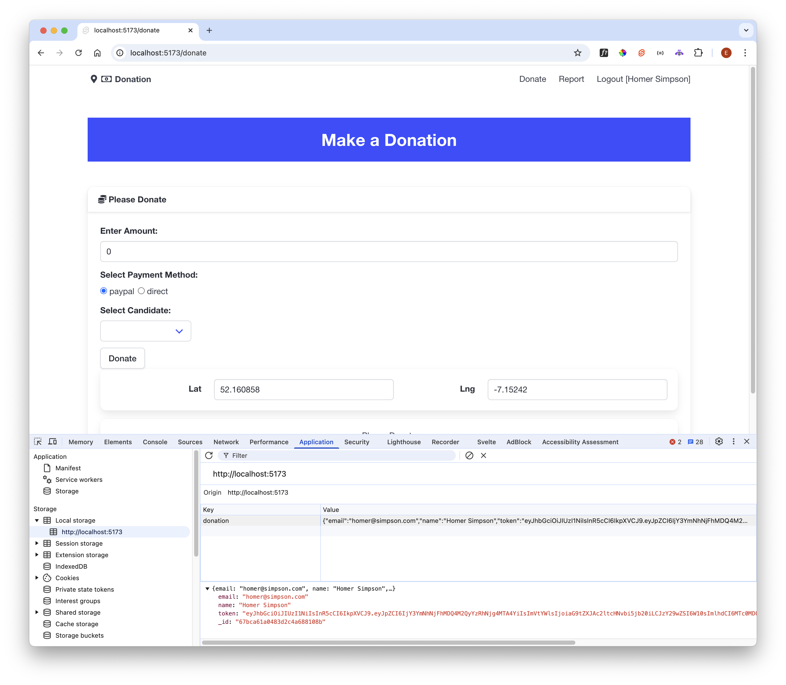

# LocalStorage

Lets look at our login function:

### src/routes/login/LoginForm.svelte

~~~typescript
  //...
  async function login() {
    console.log(`attempting to log in email: ${email} with password: ${password}`);
    let session = await donationService.login(email, password);
    if (session) {
      loggedInUser.email = email;
      loggedInUser.name = session.name;
      loggedInUser.token = session.token;
      loggedInUser._id = session._id;
      console.log(`Session: ${JSON.stringify(session)}`);
      goto("/donate");
    } else {
      email = "";
      password = "";
      message = "Invalid Credentials";
    }
  }
  //...
~~~

As we set the session, we take an additional step to store the session in `LocalStorage`

~~~typescript
  //...
      localStorage.donation = JSON.stringify(loggedInUser);
      console.log(`Session: ${JSON.stringify(session)}`);
      goto("/donate");
  //...
~~~

Here we write the session object (as a string) to this Local Storage

- <https://developer.mozilla.org/en-US/docs/Web/API/Window/localStorage>

This is a location in the browser, similar to how cookies are managed, where we can write small amounts of data, which will be associated with our application - and will persist between page loads.

Using the browser debugger as in the last step, we should be able to see the local storage contents and verify the our session is held there (after we have logged in):

Just being stored here is not sufficient to fix our page refresh issue. We need to explicitly locate and load it if we detect that the page has been refreshed (next step).