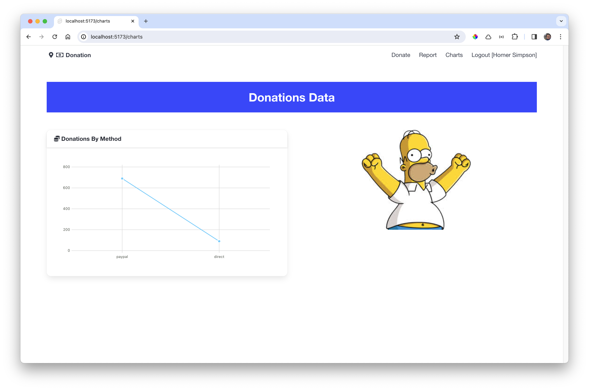
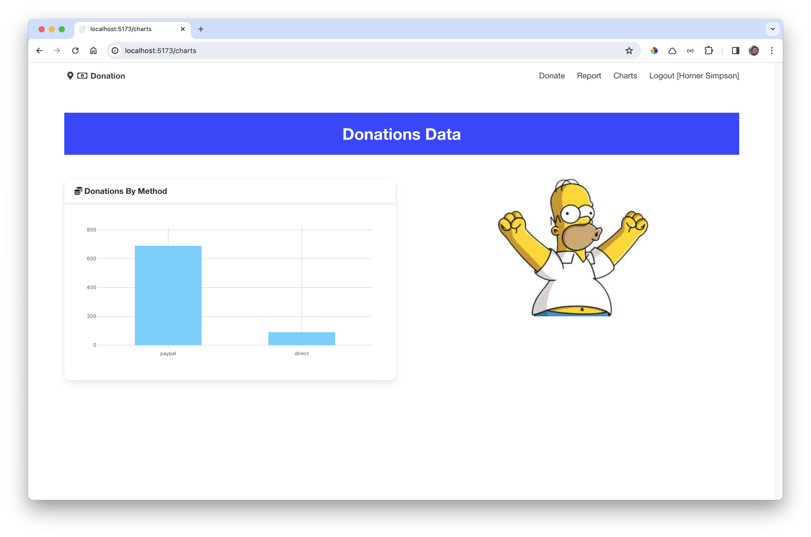
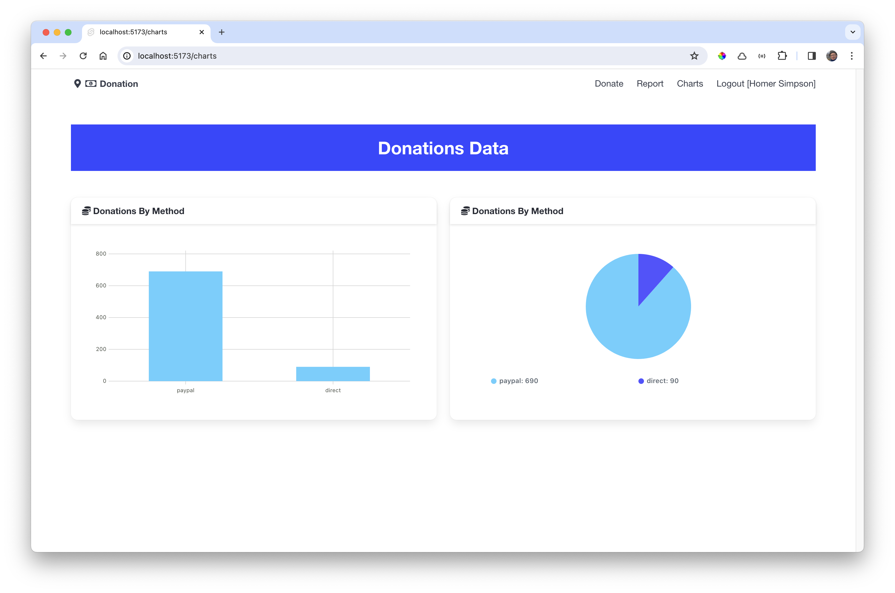

# Donations by Method

This is a revised version of the charts view, which displays a list of donations by payment method:

### src/routes/charts/+page.svelte

~~~typescript

  

    <Card title="Donations By Method">
      <Chart data={totalByMethod} type="line" />
    </Card>
  

  

    
  

~~~

In the above we are populating the totalByMethod data set with the actual amounts computed from the latest donations:

Change the chart type to `bar`:

### src/routes/charts/+page.svelte

~~~html
//...
    <Chart data={totalByMethod} type="bar" />
//...
~~~

We could lay out two charts on the same page:

### src/routes/charts/+page.svelte

~~~html
//... 

  

    <Card title="Donations By Method">
      <Chart data={totalByMethod} type="bar" />
    </Card>
  

  

    <Card title="Donations By Method">
      <Chart data={totalByMethod} type="pie" />
    </Card>
  

~~~

