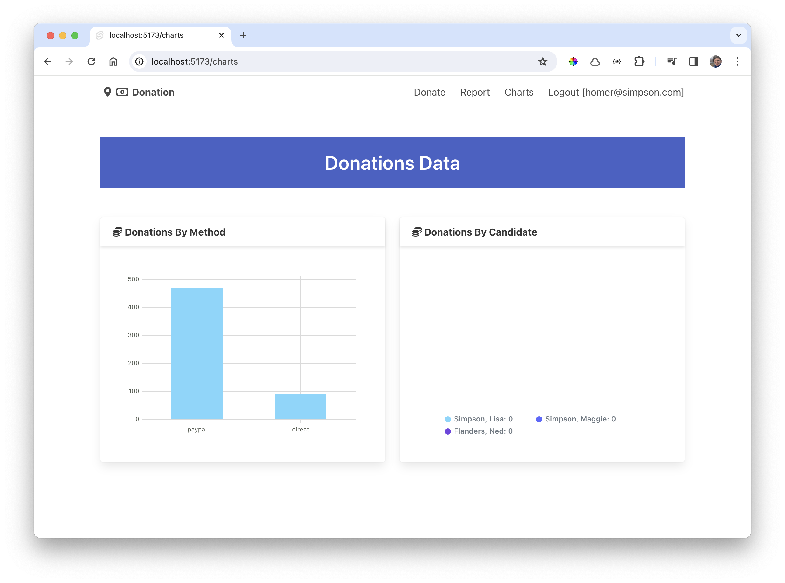
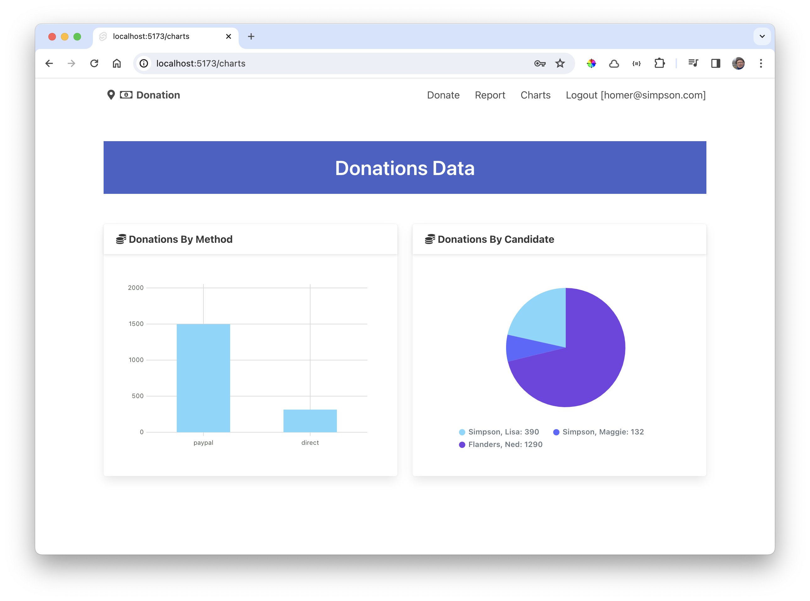

# Donations by Candidate

Lets making the charts show different data:

- Payment Methods  - this is completed.
- Donations per Candidate - todo

Introduce a new data series;

### src/routes/charts/+page.svelte

~~~typescript
  const donationsByCandidate = {
    labels: [],
    datasets: [
      {
        values: [0, 0]
      }
    ]
  };
~~~

In the onMount, initialise the labels (but not the total values) in this data:

~~~typescript
export const load = async () => {
    const candidates = await donationService.getCandidates(get(currentSession));
    donationsByCandidate.labels = [];
    candidates.forEach((candidate) => {
      // @ts-ignore
      donationsByCandidate.labels.push(`${candidate.lastName}, ${candidate.firstName}`);
      donationsByCandidate.datasets[0].values.push(0);
    });
~~~

(Note we are disabling a ts-check that TypeScript find problematic)

Change the pie chart to display the donationsByCandidate:

### src/routes/charts/+page.svelte

~~~html
      <Chart data={donationsByCandidate} type="pie" />
~~~

No data displayed yet in the second chart - just the candidate names. Append this to load to harvest the donations data:

~~~javascript
//...
    candidates.forEach((candidate, i) => {
      donationList.forEach((donation) => {
        // @ts-ignore
        if (donation.candidate._id == candidate._id) {
          donationsByCandidate.datasets[0].values[i] += donation.amount;
        }
      });
    });
//...
~~~

This is the complete charts page at this stage:

### src/routes/charts/+page.ts

~~~typescript

  

    <Card title="Donations By Method">
      <Chart data={totalByMethod} type="bar" />
    </Card>
  

  

    <Card title="Donations By Method">
      <Chart data={donationsByCandidate} type="pie" />
    </Card>
  

~~~

