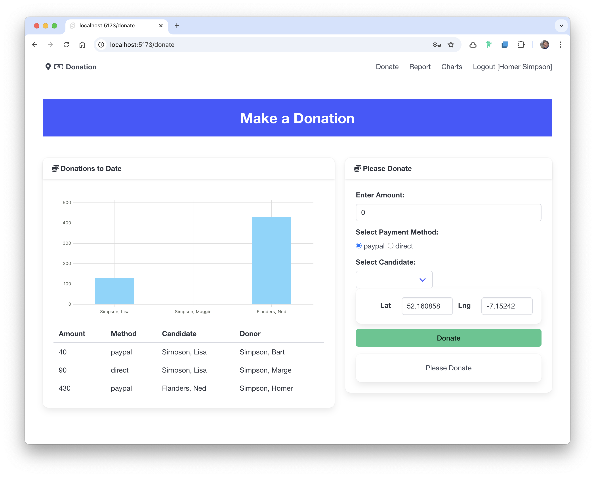

# Donate Route

Now that we have chart components defined, lets include a chart on the page:

### routes/donate/+page.svelte

~~~html

  

    <Card title="Donations to Date">
      <Chart data={curentDataSets.donationsByCandidate} type="bar" />
      <DonationList />
    </Card>
  

  

    <Card title="Please Donate">
      <DonateForm />
    </Card>
  

~~~

When you make donations you should see the table and charts update in real time - i.e. update does not requires a page refresh. This is because:

1. We are recomputing the donation data sets each time a donation is made
2. The computed data and the list of donations are stored in Svelte Runes.
