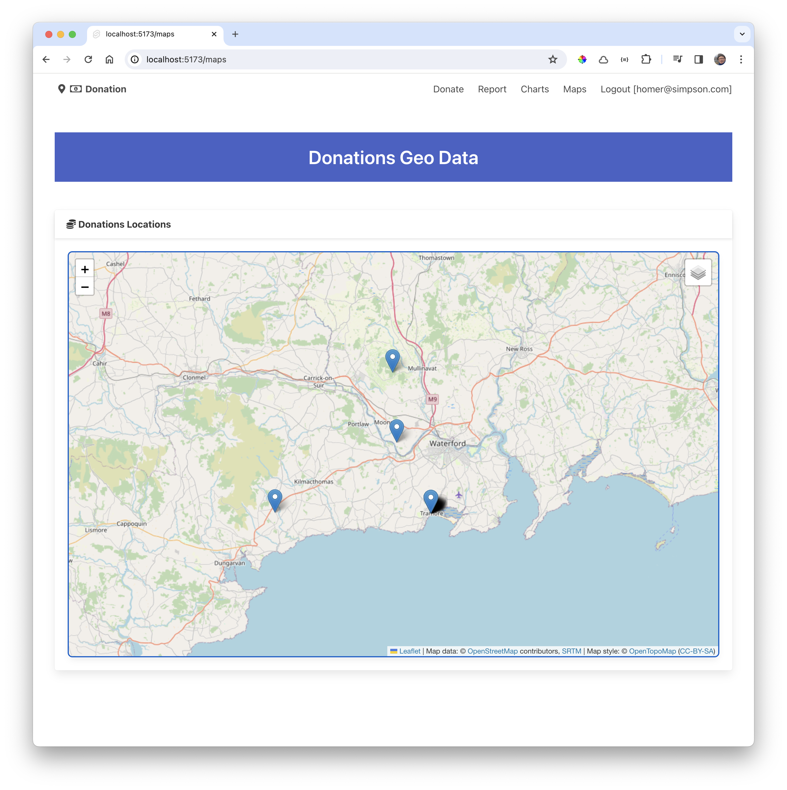

# Donations Markers

The next step will be to place markers at the location of each donation.

Introduce this new function into LeafletMap:

### lib/ui/LeafletMap.svelte

~~~typescript
  export async function addMarker(lat: number, lng: number, popupText: string) {
    const leaflet = await import("leaflet");
    L = leaflet.default;
    L.marker([lat, lng]).addTo(imap);
  }
~~~

We trigger this function the Maps route - this is a revised version::

### routes/maps/+page.svelte

~~~html

<Card title="Donations Locations">
  <LeafletMap height={60} bind:this={map} />
</Card>
~~~

The markers for our sample data should appear (you may need to pan and zoom to see the view below):

