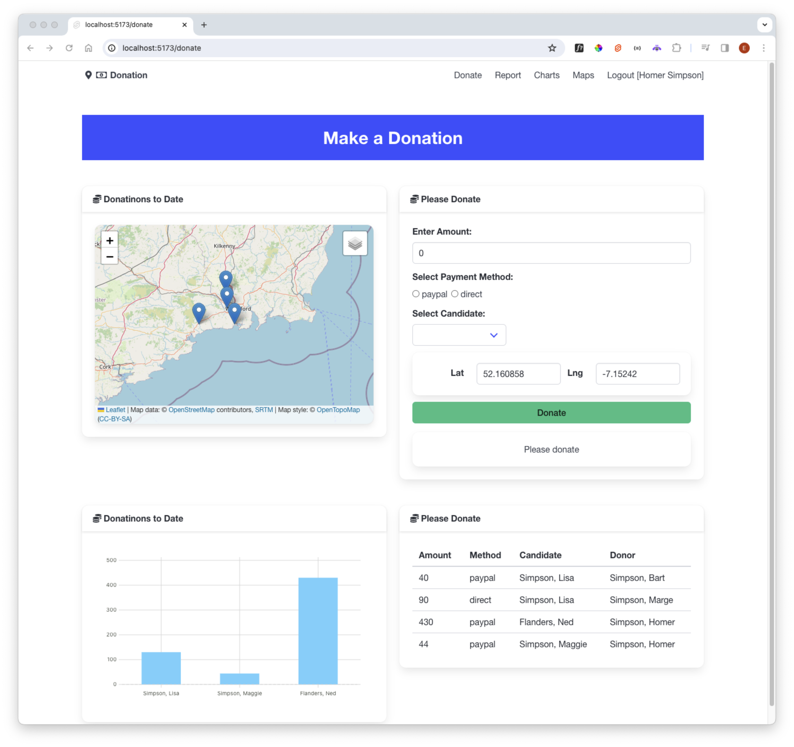

# Populate Dashboard Map

To populate the map, we have some more work to do. First, declare a map object:

### src/routes/donate/+page.svelte

~~~typescript
  let map: LeafletMap;
~~~

Make sure the LeafletMap component is bound to this object:

~~~html
      <LeafletMap height={50} bind:this={map} />
~~~

Finally, extend our `onMount` function to populate the map:

~~~typescript
  //...
  import type { Donation } from "$lib/types/donation-types";
  import { donationService } from "$lib/services/donation-service";
  import { curentDataSets, loggedInUser, subTitle } from "$lib/runes.svelte";

  onMount(async () => {
    const donations = await donationService.getDonations(loggedInUser.token);
    donations.forEach((donation: Donation) => {
      if (typeof donation.candidate !== "string") {
        const popup = `${donation.candidate.firstName} ${donation.candidate.lastName}: €${donation.amount}`;
        map.addMarker(donation.lat, donation.lng, popup);
      }
    });
    const lastDonation = donations[donations.length - 1];
    if (lastDonation) map.moveTo(lastDonation.lat, lastDonation.lng);
  });
~~~

We have copied the last few lines here from the maps view. The markers should display now:

This is the complete  page now:

### src/routes/donate/+page.svelte

~~~html

  

    <Card title="Donations to Date">
      <LeafletMap height={30} bind:this={map} />
    </Card>
  

  

    <Card title="Please Donate">
      <DonateForm />
    </Card>
  

  

    <Card title="Donations to Date">
      <Chart data={curentDataSets.donationsByCandidate} type="bar" />
    </Card>
  

  

    <Card title="Please Donate">
      <DonationList />
    </Card>
  

~~~

