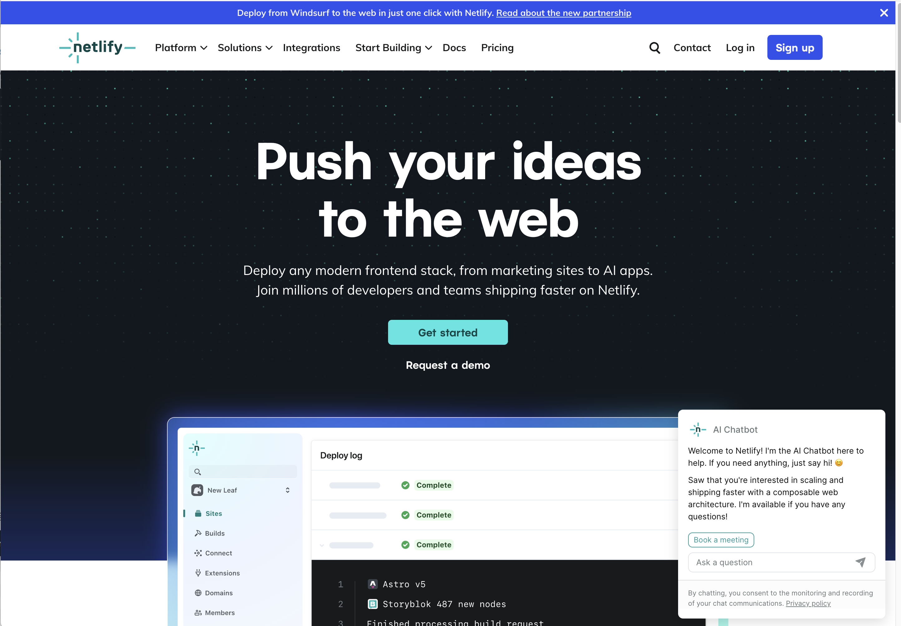

# Projects

This lab will deploy 2 projects:

- Backend project to Glitch
- Front end project to Netlify

You can use your own lab/assignment repos for this, or as an exercises these two projects:

- [Donation Hapi 04 API](https://github.com/wit-hdip-comp-sci-2024/donation-hapi-04-api)
- [Donation Svelte 07 Maps](https://github.com/wit-hdip-comp-sci-2024/donation-svelte-07-maps)

We have already covered deplpoyment for the back end, which has been covered here:

- [Deployment](https://tutors.dev/topic/wit-hdip-comp-sci-2024-full-stack-1/unit-3-deployment/topic-12-deployment)

### CORS + Port configuration

One important adjustment to verify if you are deploying your own Hapi application. When you are creating the Hapi server, make sure it is configured like this:

~~~typescript
  const server = Hapi.server({
    port: process.env.PORT || 4000,
    routes: { cors: true },
  });
~~~

You can choose to deploy the Hapi app now using either Glitch or Render as elaborated on in the labs linked above. 

### Netlify

For the front end, we will use Netlify as the platform. sign up for a free account on Netlify now.

- <https://www.netlify.com/>

