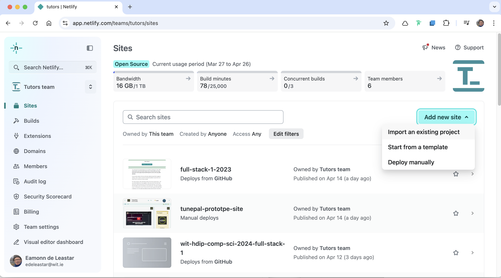
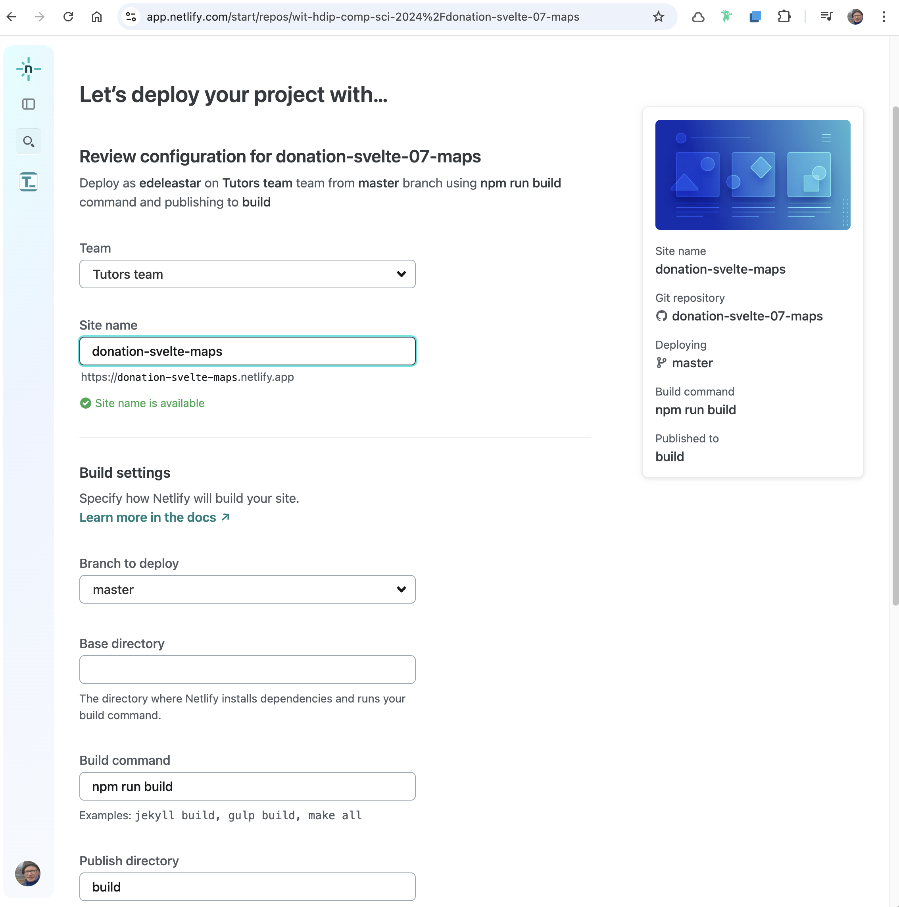
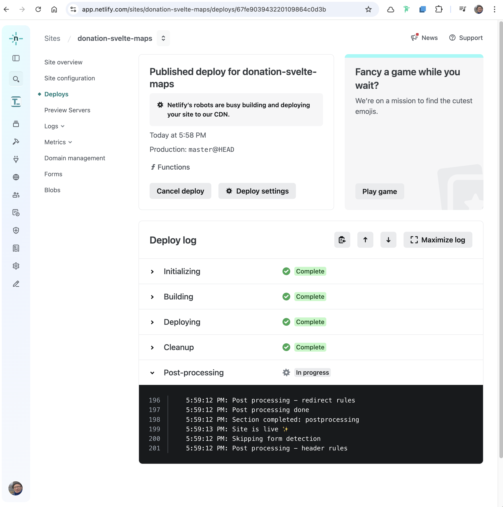
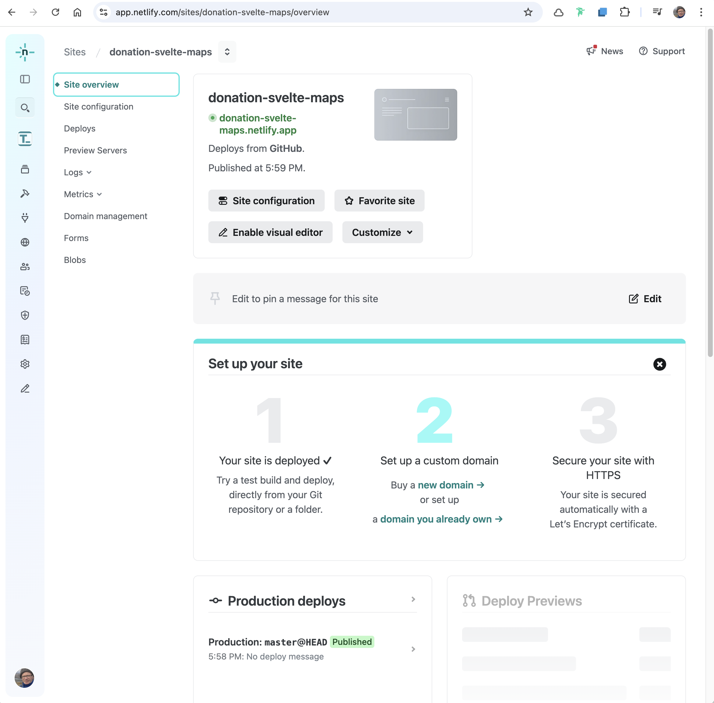
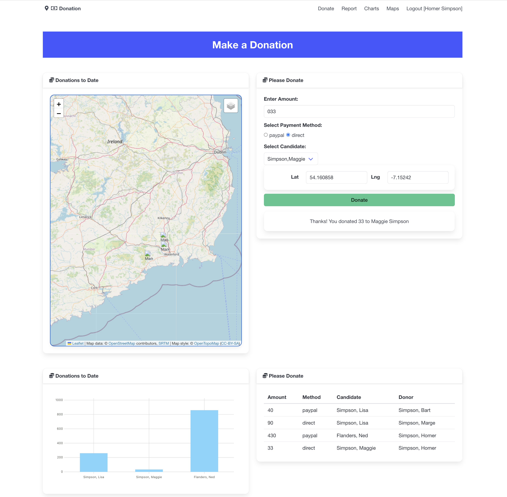

#### Create Netlify

Now, create a new project on your netlify account by "importing and existing prokect":

You will have to enable Netlify to access your github account, and then select your repo. This will then present the project configuration:

Give the site a name (which will be used for the domain), and press the "Deploy" button.

After a few minutes - if you look at the Deplpy details it should look like this:

On the site overview you can see the deplpyed url:

Open the app and see if you can log in:

If you are usingh Glitch, it might be useful to log in the back in in advance so the app is warmed up.
