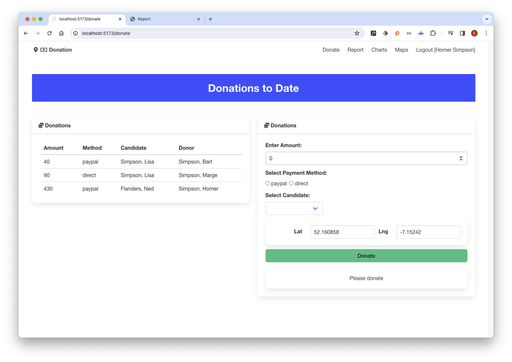

# Donate

Before converting donate, lets convert it back to a simpler version without maps or charts:

### src/routes/donate/+page.svelte

~~~html

  

    <Card title="Donations to Date">
      <DonationList {donations} />
    </Card>
  

  

    <Card title="Please Donate">
      <DonateForm {candidateList} />
    </Card>
  

~~~

We can perform a similar conversion with the donate route. First bring in the server component:

### src/routes/donate/+page.server.ts

~~~typescript
import { donationService } from "$lib/services/donation-service";
import type { Session } from "$lib/types/donation-types";
import type { PageServerLoad } from "./$types";

export const load: PageServerLoad = async ({ cookies }) => {
  const cookieStr = cookies.get("donation-user") as string;
  if (cookieStr) {
    const session = JSON.parse(cookieStr) as Session;
    return {
      donations: await donationService.getDonations(session!),
      candidates: await donationService.getCandidates(session!)
    };
  }
};
~~~

We can simplify the view:

### src/routes/donate/+page.svelte

~~~html

  

    <Card title="Donations">
      <DonationList donations={data.donations} />
    </Card>
  

  

    <Card title="Donations">
      <DonateForm candidateList={data.candidates} />
    </Card>
  

~~~

