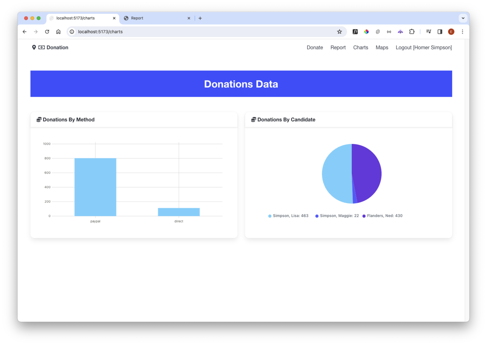

## Charts

The charts view is relatively easy to convert. First, the server component:

~~~typescript
import { donationService } from "$lib/services/donation-service";
import { generateByCandidate, generateByMethod } from "$lib/services/donation-utils";
import type { Session } from "$lib/types/donation-types";
import type { PageServerLoad } from "./$types";

export const load: PageServerLoad = async ({ cookies }) => {
  const cookieStr = cookies.get("donation-user") as string;
  if (cookieStr) {
    const session = JSON.parse(cookieStr) as Session;
    const donations = await donationService.getDonations(session);
    const candidates = await donationService.getCandidates(session);
    return {
      byMethod: generateByMethod(donations),
      byCandidate: generateByCandidate(donations, candidates)
    };
  }
};
~~~

The view can then be simplified:

~~~html

  

    <Card title="Donations By Method">
      <Chart data={data.byMethod} type="bar" />
    </Card>
  

  

    <Card title="Donations By Candidate">
      <Chart data={data.byCandidate} type="pie" />
    </Card>
  

~~~

This should now work as before.

