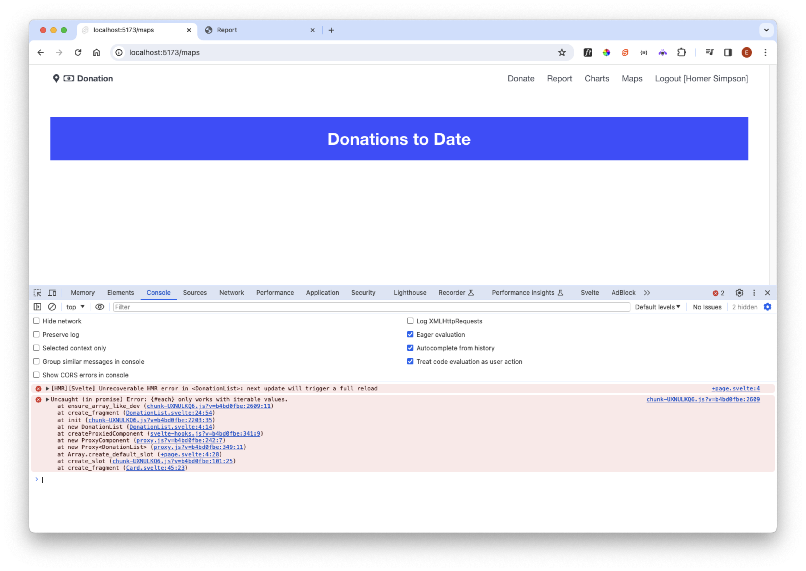

# Maps

If we switch to the maps view, we will have an error:

The LeafletMap component will need to be updated with additional checks as we are running in an SSR environment:

### src/lib/ui/LeafletMap.svelte

~~~html

~~~

This has small adjustments to make sure it will only access leaflet resource if running in a browser.

With this in place, we can introduce the server component:

### src/routes/maps/+page.server.ts

~~~typescript
import { donationService } from "$lib/services/donation-service";
import type { Session } from "$lib/types/donation-types";
import type { PageServerLoad } from "./$types";

export const load: PageServerLoad = async ({ cookies }) => {
  const cookieStr = cookies.get("donation-user") as string;
  if (cookieStr) {
    const session = JSON.parse(cookieStr) as Session;
    return {
      donations: await donationService.getDonations(session!)
    };
  }
};
~~~

This returns the donations. Now a revised and simplified view:

### src/routes/maps/+page.svelte

~~~html

<Card title="Donations Locations">
  <LeafletMap height={60} bind:this={map} />
</Card>
~~~

