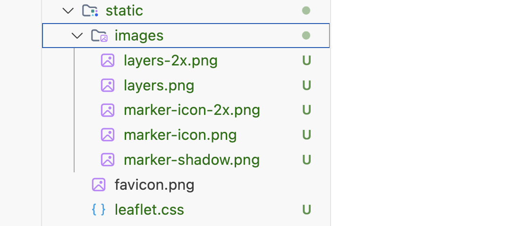

# Components

The initial external components we will use include:

- [Iconify Icons](https://docs.iconify.design/icon-components/svelte/)
- [Leaflet Maps](https://leafletjs.com/)

~~~bash
npm install @iconify/svelte -D
npm install @iconify/types -D
npm install leaflet -D
npm install @types/leaflet -D
~~~

Once installed, your package.json may look like this:

### package.json

~~~json
{
  "name": "oileain",
  "private": true,
  "version": "0.0.1",
  "type": "module",
  "scripts": {
    "dev": "vite dev",
    "build": "vite build",
    "preview": "vite preview",
    "prepare": "svelte-kit sync || echo ''",
    "check": "svelte-kit sync && svelte-check --tsconfig ./tsconfig.json",
    "check:watch": "svelte-kit sync && svelte-check --tsconfig ./tsconfig.json --watch",
    "format": "prettier --write .",
    "lint": "prettier --check . && eslint ."
  },
  "devDependencies": {
    "@eslint/compat": "^1.2.5",
    "@eslint/js": "^9.18.0",
    "@iconify/svelte": "^5.0.0",
    "@iconify/types": "^2.0.0",
    "@sveltejs/adapter-auto": "^6.0.0",
    "@sveltejs/kit": "^2.16.0",
    "@sveltejs/vite-plugin-svelte": "^5.0.0",
    "@types/leaflet": "^1.9.17",
    "eslint": "^9.18.0",
    "eslint-config-prettier": "^10.0.1",
    "eslint-plugin-svelte": "^3.0.0",
    "globals": "^16.0.0",
    "leaflet": "^1.9.4",
    "prettier": "^3.4.2",
    "prettier-plugin-svelte": "^3.3.3",
    "svelte": "^5.0.0",
    "svelte-check": "^4.0.0",
    "typescript": "^5.0.0",
    "typescript-eslint": "^8.20.0",
    "vite": "^6.2.6"
  }
}
~~~

## Leaflet Assets

Download and expand the following archive into the static folder in the project:

- [static.zip](archives/static.zip)

When expanded, the contents should look like this:

Here we are including copies of the leaflet.css and leaflet marker files. These are needed due to the way Sveltekit applications integrate the leaflet package files. If we fail to include them here, the leaflet component may malfunction - particularly when delayed on an external service.:

### Bulma

Include the bulma & leaflet css in app.html

##### src/app.html

~~~html
<!doctype html>
<html lang="en">
  <head>
    <meta charset="utf-8" />
    <link rel="icon" href="%sveltekit.assets%/favicon.png" />
    <meta name="viewport" content="width=device-width, initial-scale=1" />
    <link rel="stylesheet" href="https://cdn.jsdelivr.net/npm/bulma@1.0.4/css/bulma.min.css" />
    <link rel="stylesheet" href="/leaflet.css" />
    %sveltekit.head%
  </head>
  <body data-sveltekit-preload-data="hover">
    
%sveltekit.body%

  </body>
</html>
~~~

This will make the framework available throughout our application.

