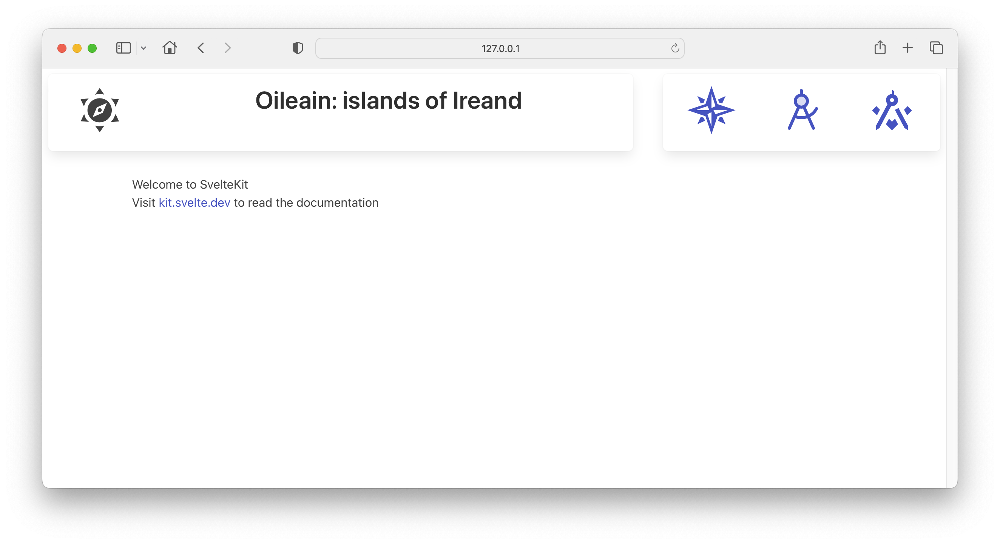
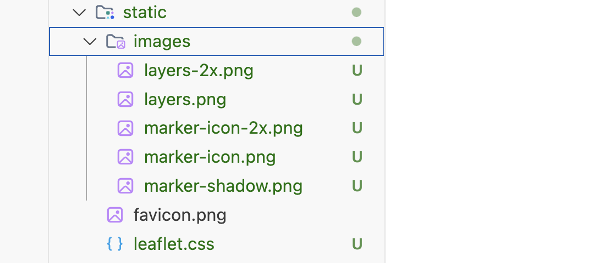
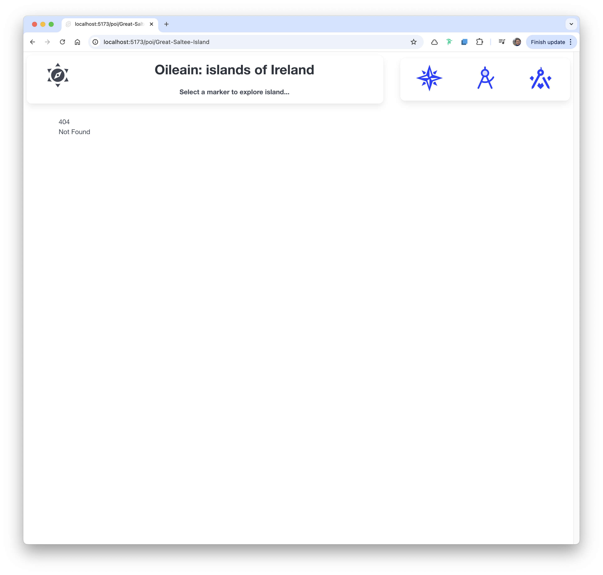

# Layout, Header, Map

Introduce the following component into a new 'lib' folder:

### lib/ui/Header.svelte

~~~html

  

    

      

        <Icon icon="mdi:sun-compass" width="64" />
      

      

        
Oileain: islands of Ireland : {currentView.value}

        {#if currentIsland.value}
          {@html currentIsland.value.nameHtml}
        {:else}
          <b> Select a marker to explore island...</b>
        {/if}
      

    

  

  

    

      <a href="/" class="column">
        <Icon icon="mdi:compass-rose" width="64" />
      </a>
      <a href="/explorer" class="column">
        <Icon icon="ph:compass-tool-duotone" width="64" />
      </a>
      <a href="/navigator/Great-Saltee-Island" class="column">
        <Icon icon="mdi:ruler-square-compass" width="64" />
      </a>
    

  

~~~

This is a new main layout:

### routes/+layout.svelte

~~~html

<Header />

  <slot />

~~~

... and the home page for the application:

### routes/+page.ts

~~~typescript
import { oileainService } from '$lib/services/oileain-service';
import type { PageLoad } from './$types';

export const load: PageLoad = async ({ params }) => {
  await oileainService.getCoasts();
  return {
    markerLayers: oileainService.markerLayers
  };
};
~~~

### routes/+page.svelte

~~~html

<LeafletMap height={85} markerLayers={data.markerLayers} />
~~~

The application should display all of the islands:

Selecting the control, we can can see that the islands are grouped by costal region:

We can also select island markers:

If click on the link in the popup - we get an invalid route:

Notice from the route that we are referring "poi/Great-Saltee-Island" - and this route does not exist in the app (yet).
