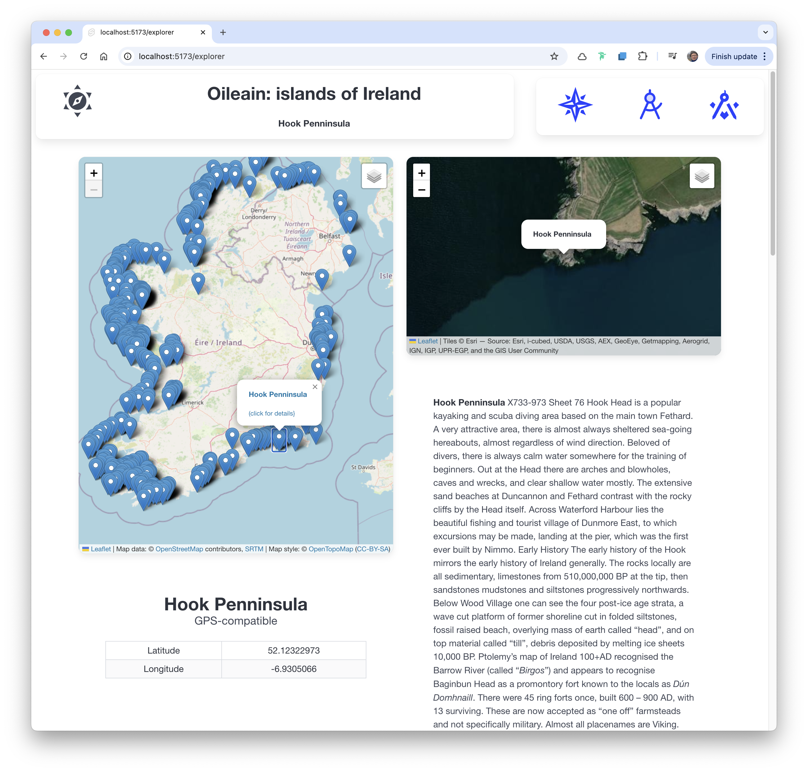

# Explorer

We call this the 'Explorer' view :

It shows the map of all islands on the left. Clicking on a marker will cause the island details to appear on the right.

First, a new component to display just the latitude/longitude:

### lib/ui/IslandLatLng.svelte

~~~html

<section class="section">
  <h1 class="title">{@html island.name}</h1>
  <h2 class="subtitle">GPS-compatible</h2>
  

    <table class="table is-bordered is-striped is-narrow is-hoverable is-fullwidth">
      <tbody>
        <tr>
          <td>Latitude</td>
          <td>{island.coordinates.geo.lat}</td>
        </tr>
        <tr>
          <td>Longitude</td>
          <td>{island.coordinates.geo.long}</td>
        </tr>
      </tbody>
    </table>
  

</section>
~~~

Define the new route/page:

### routes/explorer/+page.ts

~~~typescript
import { oileainService } from '$lib/services/oileain-service';
import type { PageLoad } from './$types';

export const load: PageLoad = async ({}) => {
  await oileainService.getCoasts();
  return {
    markerLayers: oileainService.markerLayers
  };
};
~~~

This will retrieve all coasts

### routes/explorer/+page.svelte

~~~html

  

    <LeafletMap id="map-main" zoom={7} height={60} markerLayers={data.markerLayers} />
    {#if currentIsland.value}
      <IslandLatLng island={currentIsland.value} />
    {/if}
  

  

    <LeafletMap id="map-secondary" height={30} activeLayer="Satellite" bind:this={navigator} />
    {#if currentIsland.value}
      <IslandDescription island={currentIsland.value} />
    {/if}
  

~~~

- <http://localhost:5173/explorer>

Clicking on a marker will change the display in the satellite view, the IslandDescription and the IslandLatLng views. Notice the use of the effects mechanism:

~~~typescript
  $effect(() => {
    if (markerSelected.value) {
      oileainService.getIslandById(markerSelected.value.id).then((result) => {
        currentIsland.value = result;
        navigator.addPopupMarkerAndZoom('selected', generateMarkerSpec(result));
      });
    }
  });
~~~

This is a special Svelte feature - effectively a function that will be called whenever variables used in the function change. We are accessing markerSelected  - which is a rune - that is updated in LeafletMap. Whenever it is updated, we update the CurrentIsland rune ad we trigger a refocus to a new location in the navigator LeafletMap component.

