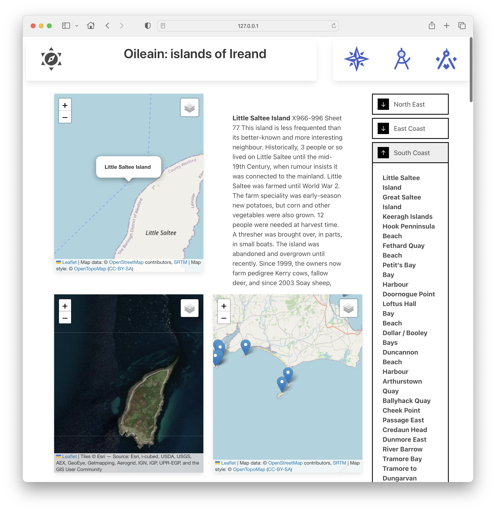

# Sidebar

We will introduce a side bar, which will list all island in an accordion, by coastal region:

Clicking on an island in the sidebar will bring is to the Navigator view:

First, introduce a side bar component to display all islands in groups:

~~~html

{#each allCoasts as coast}
	

		

			{coast.title}
		

		

			{#each coast.pois as island}
				<a href="/navigator/{island.safeName}"> {@html island.name}</a>
			{/each}
		

	

{/each}

~~~

The accordion here was sourced from this CodePen:

- https://codepen.io/havardob/pen/abBJgQo

In the layout (the basis for all pages), include and engage this component:

~~~html

<Header />

	

		

			<slot />
		

		

			<SideBar {allCoasts} />
		

	

~~~

The sidebar should appear now on all views - and clicking an island name should take you to the Navigator view for the island.

However, although the description will be updated every time you select a new island from the drop down, the maps will not be refreshed. We need one more change to Navigator to fix this:

### routes/navigator/+page.svelte

First import the SvelteKit page store:

~~~ty
	import { page } from "$app/stores";
~~~

This allows us to 'listen' for any changes to the router while the current page is being displayed. Introduce this new method to update the maps if we detect a change:

~~~typescript
	page.subscribe((path) => {
		const marker = generateMarkerSpec(data.island);
		mapTerrain?.addPopupMarkerAndZoom("selected", marker);
		mapSat?.moveTo(marker.location, 14);
		mapContext?.moveTo(marker.location, 10);
	});
~~~

As we click different islands in the sidebar we should see all aspects of the Navigator view updated.