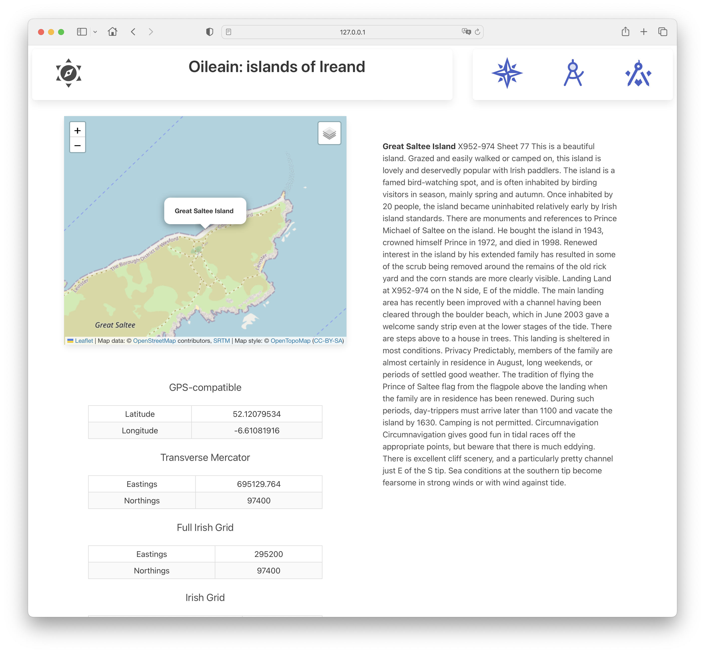

# Sidebar

We will introduce a side bar, which will list all island in an accordion, by coastal region:

Clicking on an island in the sidebar will bring is to the Poi view.

First, introduce a side bar component to display all islands in groups:

~~~html

{#each allCoasts as coast}
  

    

      {coast.title}
    

    

      {#each coast.pois as island}
        <a href="/poi/{island.safeName}"> {@html island.name}</a>
      {/each}
    

  

{/each}

~~~

Notice how each link in the sidebar is structured like this:

~~~html
      {#each coast.pois as island}
        <a href="/poi/{island.safeName}"> {@html island.name}</a>
      {/each}
~~~

Each link is to the poi route.

In the layout (the basis for all pages), include and engage this component:

~~~html

<Header />

  

    

      <slot />
    

    

      <SideBar {allCoasts} />
    

  

~~~

The sidebar should appear now on all views - and clicking an island name should take you to the Poi view for the island - and while on the Poi view you will be able to move around the coast by clicking along the menu sequentially.
