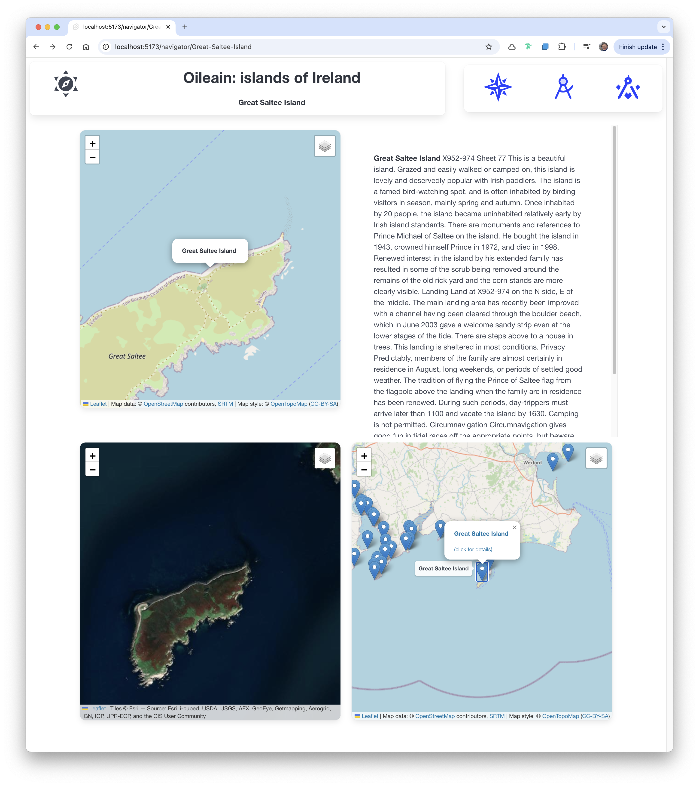

# Navigator

Lets try another experiment - a more complex view with three maps showing different aspects:

Like the poi route, this will also take a parameter, so include a '[id]' segment in the route:

### routes/navigator/[id]/+page.ts

~~~typescript
import { oileainService } from "$lib/services/oileain-service";
import { generateMarkerSpec } from "$lib/services/oileain-utils";
import type { PageLoad } from "./$types";

export const load: PageLoad = async ({ params }) => {
  await oileainService.getCoasts();
  const island = await oileainService.getIslandById(encodeURI(params.id));
  const marker = generateMarkerSpec(island);
  return {
    island,
    marker,
    markerLayers: oileainService.markerLayers
  };
};
~~~

The load function here is returning an island, its marker, and the marker layers for the complete map to the view.

### routes/navigator/[id]/+page.svelte

~~~html

  

    <LeafletMap id="terrain" height={40} bind:this={mapTerrain} zoom={14} />
  

  

    <IslandDescription island={currentIsland?.value} />
  

  

    <LeafletMap id="sat" activeLayer={'Satellite'} height={40} bind:this={mapSat} zoom={14} />
  

  

    <LeafletMap id="context" height={40} markerLayers={data.markerLayers} bind:this={mapContext} zoom={12} />
  

~~~

The key functions are:

- onMount : which is triggered when the page is loaded
- $effect: triggered when the rune is it accessing (markerSelected) is changed. 
